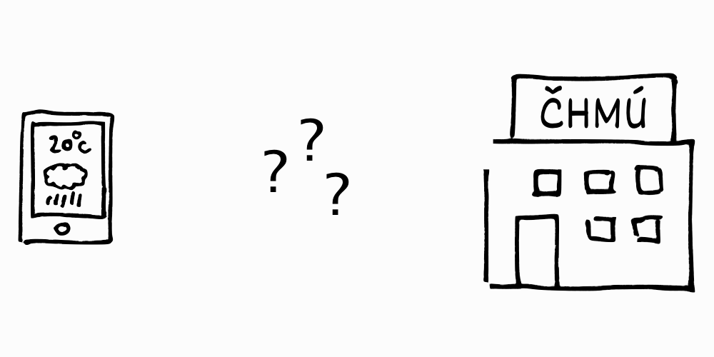
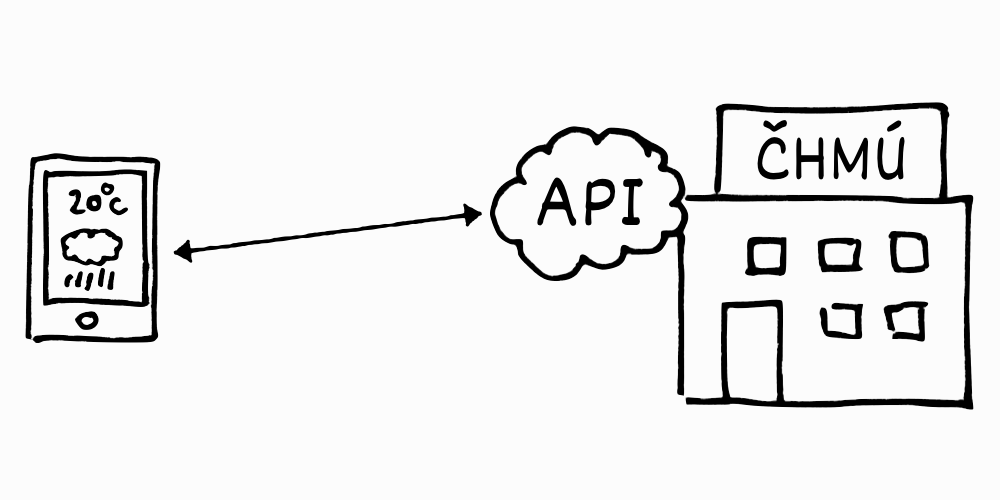
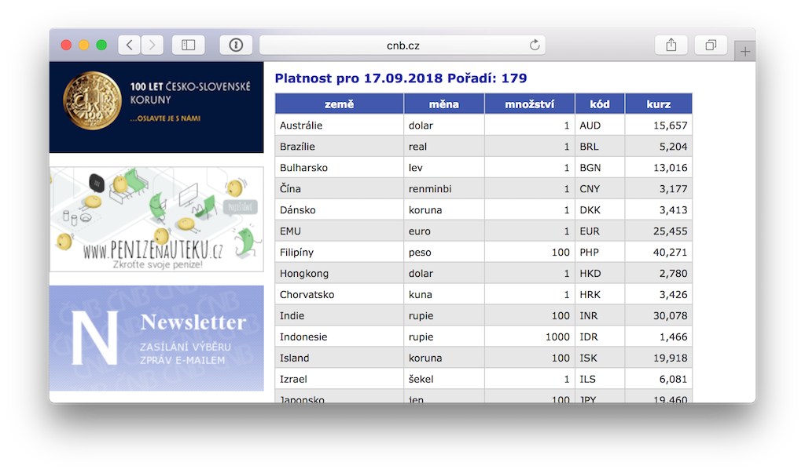
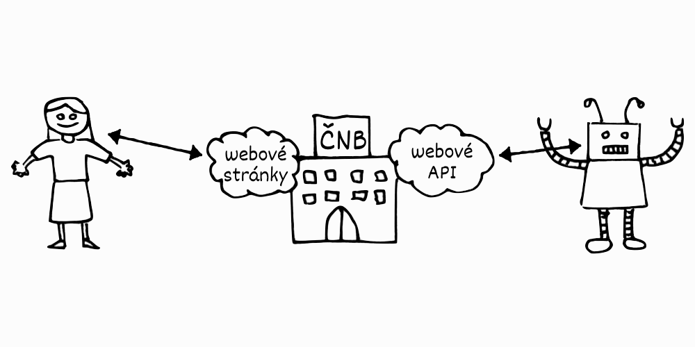
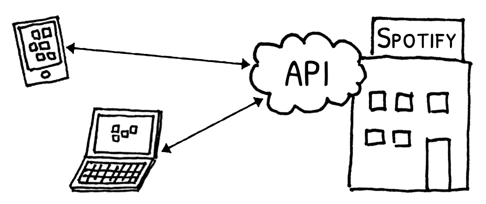
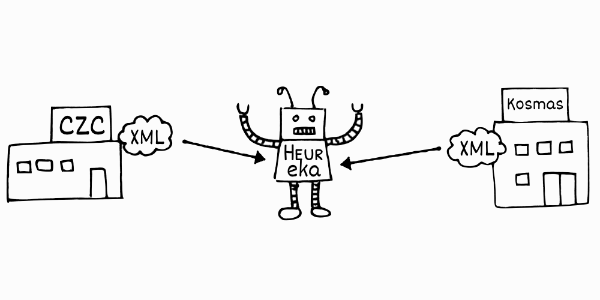
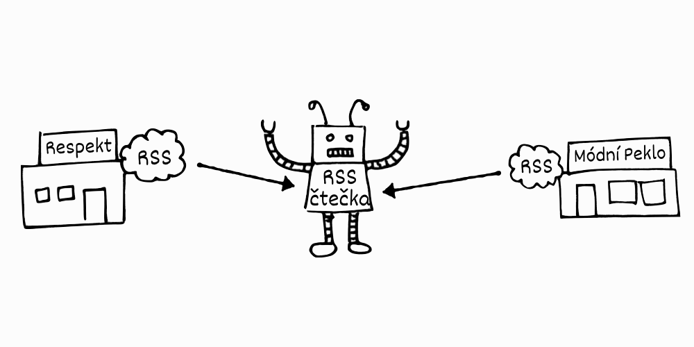

.. _uvod:

Úvod do API
===========

Na API si nelze sáhnout a není možné je vidět, ale přesto dnes nepřímo ovlivňují život každého z nás. Bohužel není snadné zjistit, co ona API vlastně jsou. `Článek na Wikipedii <https://cs.wikipedia.org/wiki/API>`__ začíná tím, že jde o *rozhraní pro programování aplikací*, a pokračuje odborným textem, jímž se běžný smrtelník prokouše jen těžko. Tento text se snaží API **vysvětlit na příkladu a běžnými slovy**.

.. _chmu:

Předpověď počasí na mobilu
--------------------------

Na jakémkoliv mobilu dnes najdete předpověď počasí. Jak se tam ale dostane? Nejspíš tušíte, že předpovědi vznikají v `Českém hydrometeorologickém ústavu <https://cs.wikipedia.org/wiki/%C4%8Cesk%C3%BD_hydrometeorologick%C3%BD_%C3%BAstav>`__. Jak je ale možné, že jakmile se v ČHMÚ shodnou na zítřejší bouřce, objeví se vám to **během sekundy** na displeji?

Ať už šlo o noviny, rozhlas nebo televizi, dříve redakcím stačilo, aby si předpověď zjistily **jednou denně**. Nevím, jak to přesně probíhalo, ale představuji si, že někdo zavolal do sídla ČHMÚ v Komořanech, kde to zvedli a nadiktovali sluníčka nebo mráčky. Dnes už by to takto fungovat nemohlo. Data o počasí, která ČHMÚ uveřejňuje, je potřeba **okamžitě zobrazovat na tisícovkách míst na internetu**.

ČHMÚ má svoje webové stránky, kde předpovědi uveřejňuje. Jenže to vyžaduje, aby je na druhé straně **přečetl člověk a někam je přepsal**. Zatímco u redakcí si snad lze představit studenta žurnalistiky na brigádě, jak zoufale nonstop sleduje web ČHMÚ a opisuje povodňová varování na web zpravodajství, pro aplikaci ve vašem mobilu by toto byla nepřekonatelná komplikace.

Váš mobil potřebuje mít možnost **zjistit si předpověď automaticky**. Ústav tedy ukládá informace o počasí tak, aby byly **strojově čitelné**, a zpřístupňuje je **ke stažení** na svém webu. Představte si to zhruba tak, že místo aby nakreslili mráčky na svůj web, uloží odborníci v ČHMÚ všechno do nějaké tabulky, třeba i Excelové, kde je předem dané, co znamená jaký řádek a sloupec. Navíc jasně řeknou, že tato tabulka se bude vždy nacházet na adrese ``https://chmi.cz/predpoved.xslx`` a budou v ní vždy aktuální informace.

Aplikace ve vašem mobilu pak může z adresy ``https://chmi.cz/predpoved.xslx`` každou hodinu tabulku stáhnout, rozluštit její řádky a sloupce, poskládat z toho aktuální předpověď počasí a zobrazit vám ji jako mráčky. No a tomuto mechanismu, kdy **jedna strana něco na stabilní adrese poskytne ve strojově čitelné formě, a druhá je schopna to kdykoliv strojově číst a něco užitečného s tím dělat**, se říká webové API.

.. _cnb:

Příklad: Kurzy měn
------------------

Jako příklad API se pojďme podívat na kurzovní lístek České národní banky. Půjdeme na stránku `Kurzy devizového trhu <https://www.cnb.cz/cs/financni_trhy/devizovy_trh/kurzy_devizoveho_trhu/denni_kurz.jsp>`__, kde ČNB vypisuje tabulku kurzů.

Pokud bychom chtěli mít e-shop, na kterém bude možné kromě korun platit i eurem, nebo pokud bychom tvořili mobilní appku na převod měn, bude se nám tento kurzovní lístek určitě hodit.

Jenže zatímco se takovýto lístek čte velmi pěkně lidem, strojově je čitelný mizerně. Není to sice nemožné, ale není to příjemné a především to není vůbec spolehlivé.

ČNB proto poskytuje jednoduché API. Pod tabulkou je odkaz `Stažení v textovém formátu <https://www.cnb.cz/cs/financni_trhy/devizovy_trh/kurzy_devizoveho_trhu/denni_kurz.txt>`__, který vede na tu samou tabulku, ale ve formátu, který lze snadněji a především spolehlivě strojově přečíst.

.. image:: ../_static/images/cnb-api.png
    :alt: ČNB - kurzovní lístek v textovém formátu
    :align: center

Webová API, která možná znáte
-----------------------------

Mobilní aplikace
^^^^^^^^^^^^^^^^

Skoro všechny aplikace na našem mobilním telefonu za sebou mají API, pomocí kterého komunikují se službou na pozadí. Když si na mobilu spustíme přehrávač hudby `Spotify <https://spotify.com/>`__ a označíme si `Futuretro <https://cs.wikipedia.org/wiki/Futuretro>`__ od `Tata Bojs <https://cs.wikipedia.org/wiki/Tata_Bojs>`__ jako oblíbené album, mobilní appka tuto informaci okamžitě pošle přes API na :ref:`server <server>` do centrály Spotify. Když potom půjdeme k počítači a otevřeme si na něm program Spotify, ten si zase přes API všechno zjistí a uvidíme, že Futuretro se i tam zobrazuje v našich oblíbených albech.

.. _heureka:

Srovnávače zboží
^^^^^^^^^^^^^^^^

Pokud máme e-shop, možná bychom chtěli, aby byly naše produkty k nalezení na `Heureka.cz <https://www.heureka.cz/>`__. Jak to funguje? Je potřeba informace o produktech vystavit do souboru ve formátu :ref:`XML <xml>`. Heureka přímo `předepisuje, jak má takový soubor vypadat <https://sluzby.heureka.cz/napoveda/xml-feed/>`__. Pokud jej dáme k dispozici, vystavujeme tím API pro Heureku. Na její straně potom může nějaký robot přes takováto jednotlivá API automaticky načítat informace o produktech z e-shopů.

Nové články
^^^^^^^^^^^

Říká vám něco `RSS <https://cs.wikipedia.org/wiki/RSS>`__? Dnes je tato technologie mírně za zenitem, ale dříve jí byl plný internet. Je to způsob, jak může váš blog nebo zpravodajský server dávat ostatním najevo, že na něm vyšly nové články.

    Symbol označující RSS

Funguje to tak, že váš blog vystaví do souboru ve formátu :ref:`XML <xml>` informace o publikovaných článcích. Kdokoliv jiný pak může tento soubor stáhnout a strojově přečíst. To dělaly RSS čtečky, jako například `Google Reader <https://cs.wikipedia.org/wiki/Google_Reader>`__. Dnes tak funguje `Feedly <https://feedly.com/>`__. Běžný uživatel se dnes již s RSS tak často nesetká, protože jeho funkci nahradily sociální sítě, ale weby jej stále poskytují - například časopis `Respekt <https://www.respekt.cz/>`__ má hned `několik RSS pro každou rubriku <https://www.respekt.cz/rss>`__.

Existují i jiná API než webová?
-------------------------------

Termín API je ve skutečnosti obecnější. Původně označuje dohodu o tom, jak si spolu mají povídat různé ucelené kusy jednoho programu. Často se v tomto smyslu používá jen slovo *interface*, česky *rozhraní*, které ve zkratce API představuje písmeno I.

Webové API je také takovou dohodou, akorát ne mezi kusy jednoho programu, spíše mezi celými samostatnými programy a celými informačními systémy (firmami, institucemi), zařízeními (mobil, počítač), apod.

Když se tedy lidé baví o programování, je dobré myslet i na onen širší význam a nenechat se vyvést z míry, pokud někdo jako API označí i jiné věci, než jsou webová API. Mezi běžnými smrtelníky a všude v tomto textu však platí to, že API vždy znamená webové API.

Kam dál?
--------

Zatímco tato kapitola by měla být srozumitelná každému, všechny následující již vyžadují základní programátorské dovednosti. Ty lze získat například na `Nauč se Python! <https://naucse.python.cz/>`_

V dalších kapitolách si vysvětlíme některé základní pojmy, naučíme se jak cizí API využít v našem programu a vytvoříme si i svoje vlastní malé API.
