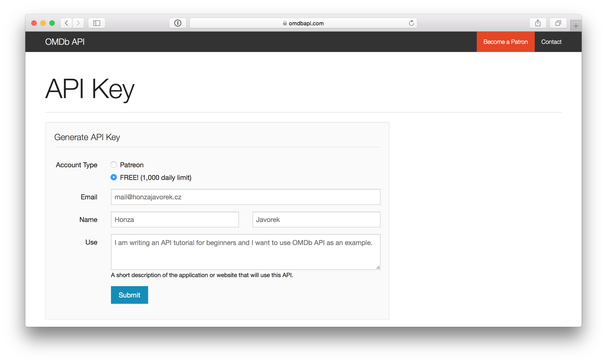
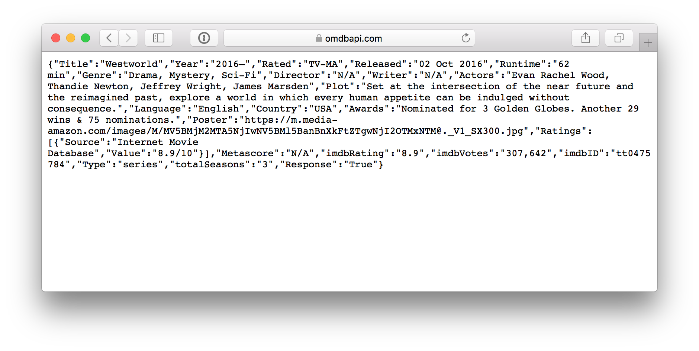
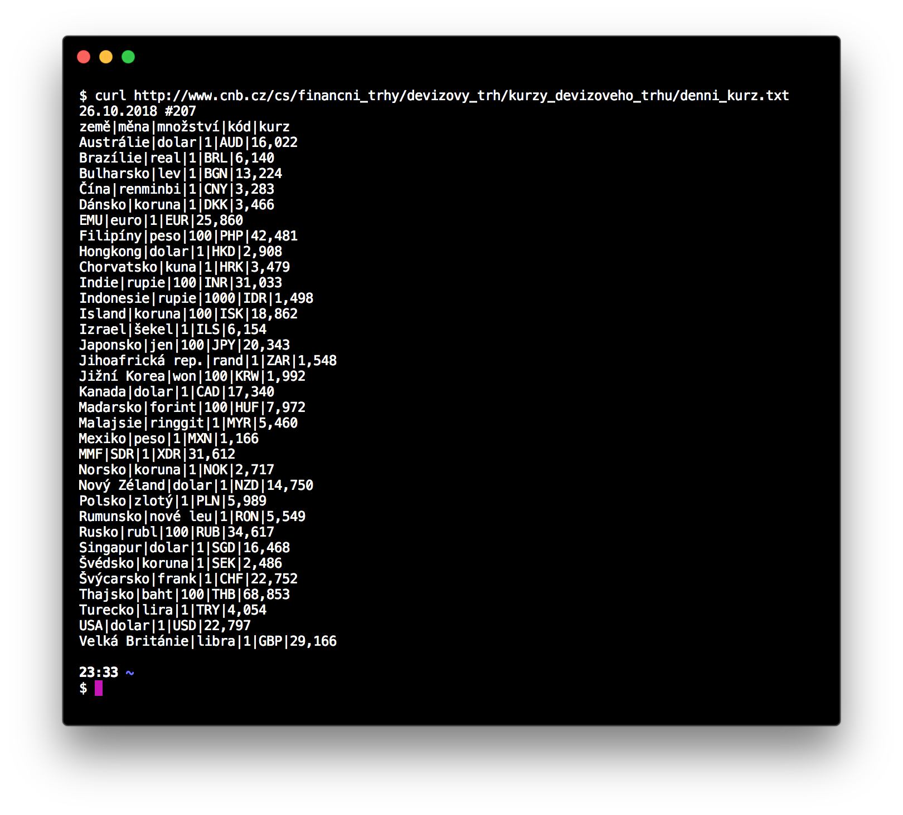
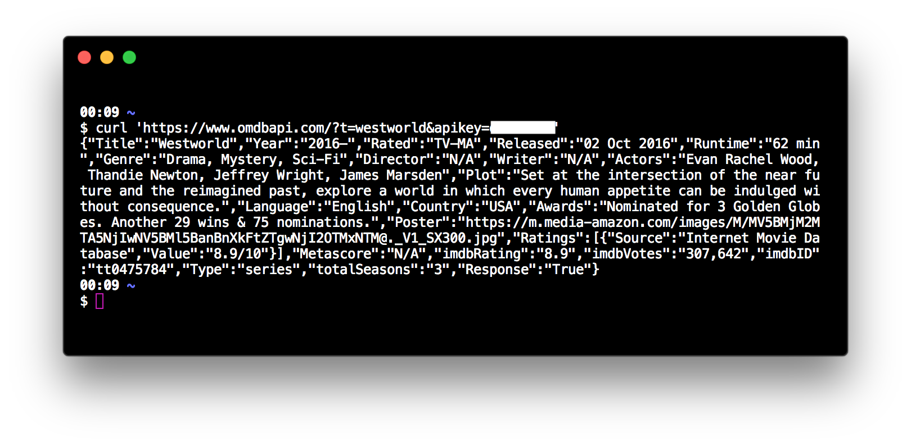

.. _klient:
.. _server:
.. _klient-server:

Klient a server
===============

Jak jsme si vysvětlili v :ref:`předešlé kapitole <uvod>`, API je dohoda mezi dvěma stranami o tom, jak si mezi sebou budou povídat. Těmto stranám se říká *klient* a *server*.

**Server** je ta strana, která má zajímavé informace, nebo něco zajímavého umí, a umožňuje ostatním na internetu, aby toho využili. V našem počátečním příkladu by se v širším slova smyslu dal jako server označit :ref:`ČHMÚ <chmu>`, jenž poskytuje API ke svým předpovědím počasí, nebo :ref:`ČNB <cnb>`, která poskytuje API ke svému kurzovnímu lístku. Ve skutečnosti je server program, který donekonečna běží na nějakém počítači oné instituce a je připraven všem ostatním na internetu odpovídat na dotazy.

**Klient** je program, který posílá dotazy na server a z odpovědí se snaží poskládat něco užitečného. Klient je tedy :ref:`mobilní aplikace s mráčky a sluníčky <cnb>` nebo náš prohlížeč, v němž jsme si :ref:`otevírali kurzovní lístek ČNB <cnb>`. Je to ale i ten :ref:`robot <heureka>`, který za Heureku načítá informace o zboží v e-shopech.

.. todo::
    obrazek server/klient, jeden server ktery poskytuje data a dva klienti, robot a clovek, jak to ctou, udelat tam jasne request response

Obecný klient
-------------

Mobilní aplikace na počasí je klient, který někdo vytvořil pro jeden konkrétní úkol. Takový většinou umí pracovat jen s jedním konkrétním API. To je užitečné, pokud chceme akorát vědět jaké je počasí, ale už méně, pokud si chceme zkoušet práci s více API zároveň. Proto existují obecní klienti.

Prohlížeč jako obecný klient
~~~~~~~~~~~~~~~~~~~~~~~~~~~~

Pokud z API chceme pouze číst a ono nevyžaduje žádné přihlašování, můžeme jej vyzkoušet i v prohlížeči, jako by to byla webová stránka. To jsme si ostatně už dříve předvedli v případě :ref:`kurzovního lístku ČNB <cnb>`. Pokud v prohlížeči přejdeme na odkaz `Stažení v textovém formátu <http://www.cnb.cz/cs/financni_trhy/devizovy_trh/kurzy_devizoveho_trhu/denni_kurz.txt>`__, uvidíme odpověď z API serveru.

.. image:: ../_static/images/cnb-api.png
    :alt: ČNB - kurzovní lístek v textovém formátu
    :align: center

Zkusme jiný příklad. `OMDb <https://www.omdbapi.com/>`_ je API, které poskytuje informace o filmech. Po `registraci <https://www.omdbapi.com/apikey.aspx>`_ nám bude na e-mail zaslán tajný klíč, se kterým můžeme na API zdarma posílat 1000 dotazů denně.

Nyní zkusme v API najít seriál `Westworld <https://www.csfd.cz/film/395723-westworld/>`_. Podle dokumentace OMDb můžeme složit následující adresu, pokud hledáme slovo ``westworld`` v názvu titulu::

    https://www.omdbapi.com/?t=westworld&apikey=abcd123

Místo ``abcd123`` má být samozřejmě tajný API klíč, který nám přišel e-mailem. Zkusíme adresu otevřít v prohlížeči:

Smyslem API je vracet odpovědi pro stroje, takže dostaneme změť písmenek, která se člověku nečte zrovna nejlépe. Něco v ní ale vidět lze - není těžké rozluštit, že seriál je drama a hraje v něm `Evan Rachel Wood <https://www.csfd.cz/tvurce/5264-evan-rachel-wood/>`__.

Obecný klient v terminálu: curl
~~~~~~~~~~~~~~~~~~~~~~~~~~~~~~~

Pokud se k API budeme potřebovat přihlásit nebo s ním zkoušet dělat složitější věci než jen čtení, nebude nám prohlížeč stačit.

Proto je dobré se naučit používat program `curl <https://curl.haxx.se/>`__. Spouští se v příkazové řádce a je to švýcarský nůž všech, kteří se pohybují kolem webových API. Je tak používaný a významný, že za něj jeho autor `dostal v roce 2017 ocenění z rukou švédského krále <https://daniel.haxx.se/blog/2017/10/20/my-night-at-the-museum/>`__.

Instalace curl
^^^^^^^^^^^^^^

.. tabs::

    .. group-tab:: Linux

        Je dost možné, že curl je již přímo v systému a není potřeba nic instalovat. Zkusíme nechat program vypsat svou verzi, čímž ověříme, jestli je k dispozici:

        .. code-block:: shell

            $ curl --version
            curl x.x.x (...) ...
            Protocols: ...
            Features: ...

        Pokud se místo verze vypíše něco v tom smyslu, že příkaz ani program toho jména neexistuje, nainstalujeme curl standardní cestou přes svého správce balíčků. V distribucích Debian nebo Ubuntu takto:

        .. code-block:: shell

            $ sudo apt-get install curl

        V distribuci Fedora takto:

        .. code-block:: shell

            $ sudo dnf install curl

    .. group-tab:: macOS

        Program curl je k dispozici přímo v systému, není potřeba nic instalovat.

    .. group-tab:: Windows

        Pokud používáme *Git for Windows* nebo *Cygwin*, je velká šance, že curl už máme, jen jej musíme spouštět ze speciálního terminálu poskytovaného těmito nástroji.

        Pokud používáme `Chocolatey <https://chocolatey.org/>`__, mělo by stačit v terminálu spustit následující:

        .. code-block:: shell

            $ choco install curl

        Jinak musíme curl stáhnout a nainstalovat ručně. Na `stránkách programu <https://curl.haxx.se/dlwiz/?type=bin&os=Win64&flav=-&ver=*&cpu=x86_64>`__ vybereme tu verzi, která má v popisku *SSL enabled* a *file is packaged using zip*. Klikneme na :kbd:`Download`. Rozbalíme stáhnutý zip, najdeme ``curl.exe`` a přidáme jej do systémové cesty.

        Nakonec necháme program vypsat svou verzi, čímž ověříme, jestli funguje:

        .. code-block:: shell

            $ curl --version
            curl x.x.x (...) ...
            Protocols: ...
            Features: ...

        .. note::

            Tento instalační návod je pro úplné začátečníky příliš stručný, ale snad si většina lidí nějak poradí. Můžete také :ref:`pomoci návod rozšířit <contributing>`.

Příklady s curl
^^^^^^^^^^^^^^^

Nyní můžeme curl vyzkoušet::

    $ curl 'http://www.cnb.cz/cs/financni_trhy/devizovy_trh/kurzy_devizoveho_trhu/denni_kurz.txt'

Když příkaz zadáme a spustíme, říkáme tím programu curl, že má poslat požadavek na uvedenou adresu a vypsat to, co mu ČNB pošle zpět.

Totéž můžeme udělat i s adresou, která nám vracela informace z OMDb.

Program curl toho samozřejmě umí více a proto je tak užitečný, ale to si ukážeme později.

Obecný klient jako aplikace
~~~~~~~~~~~~~~~~~~~~~~~~~~~

Příkazová řádka je sice velmi mocný a univerzální nástroj, ale není vždy nejpříjemnější na každodenní používání. Následující programy jsou obecní klienti, na které se dá normálně klikat:

- `Postman <https://www.getpostman.com/>`__ - zdarma, pro všechny operační systémy
- `RESTClient <https://addons.mozilla.org/en-US/firefox/addon/restclient/>`__ - zdarma, pro všechny operační systémy, doplněk do prohlížeče `Firefox <https://www.mozilla.org/firefox/>`__
- `Paw <https://paw.cloud/>`__ - dražší, ale velmi vyladěný profesionální nástroj pro macOS

Stejně jako v případě práce s `Gitem <https://git-scm.com/>`__ i zde platí, že si můžeme nainstalovat sebekrásnější program, ale pokud budeme potřebovat vyřešit nějaký problém, dostaneme rady většinou v podobě curl příkazu.

Stejně jako u Gitu i curl má velmi složitý systém paramterů a přepínátek, stejně jako u Gitu jim málokdo dokonale rozumí, ale stejně jako u Gitu je to přesně to, co lidé nakonec používají jako společný *jazyk*, do kterého zapisují a přes který sdílí řešení problémů - například na `StackOverflow <https://stackoverflow.com/questions/tagged/curl>`__.

Klient pro konkrétní úkol
-------------------------

Obecného klienta musí ovládat člověk. To je přesně to, co potřebujeme, když si chceme nějaké API vyzkoušet, ale celý smysl API je v tom, aby je programy mohly využívat automaticky.

K tomu slouží klienti, které někdo vytvořil pro konkrétní úkol. Jak už jsme si řekli, je to třeba ona aplikace pro zobrazování počasí, která je schopna si data z API přečíst úplně sama. Aby to ale mohla udělat, musí odpověď ze serveru přijít ve formátu, kterému bude rozumět. A o tom, jak to celé funguje, bude následující kapitola.
