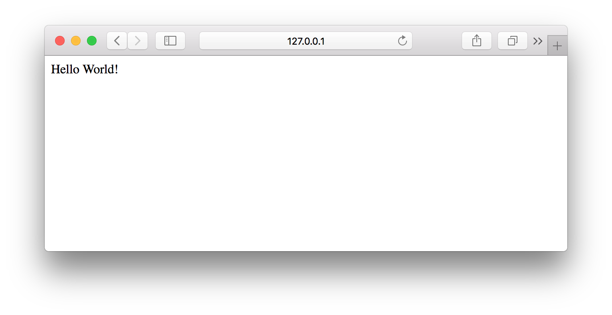
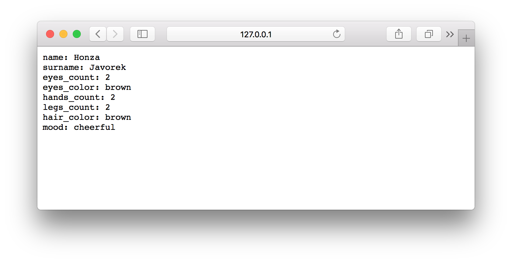

Tvoříme server
==============

Konec teorie, pojďme si vyzkoušet nabyté znalosti v praxi. Začneme tím, že zkusíme vyrobit jednoduché API. Použijeme jazyk Python 3 a framework `Flask <http://flask.pocoo.org/>`__, který se hodí na webové aplikace malého rozsahu.

Základ aplikace
---------------

Vytvoříme si pro náš projekt adresář ``server`` a v něm `virtuální prostředí <https://naucse.python.cz/course/pyladies/beginners/venv-setup/>`__, které si aktivujeme. Poté nainstalujeme Flask:

.. code-block:: shell

    (venv)$ pip install flask

Nyní můžeme začít s tvorbou API. Je to podobné, jako bychom ve Flasku dělali webové stránky, ale místo HTML budeme vracet JSON. Vytvoříme si soubor ``hello.py`` a do něj zkopírujeme `úvodní příklad ze stránek frameworku <http://flask.pocoo.org/>`__:

.. code-block:: python

    from flask import Flask
    app = Flask(__name__)

    @app.route("/")
    def hello():
        return "Hello World!"

Hned pod příkladem nám stránky frameworku radí jak můžeme aplikaci spustit. Uděláme to tedy:

.. code-block:: text

    $ FLASK_APP=hello.py flask run
     * Serving Flask app "hello.py"
     * Environment: production
     WARNING: Do not use the development server in a production environment.
     Use a production WSGI server instead.
     * Debug mode: off
     * Running on http://127.0.0.1:5000/ (Press CTRL+C to quit)

.. note::
    Pozor, na Windows musíme Flask spouštět následovně:

    .. code-block:: text

        C:\nějaká\cesta> set FLASK_APP=hello.py
        C:\nějaká\cesta> python -m flask run

Když nyní v prohlížeči půjdeme na adresu ``http://127.0.0.1:5000/``, měli bychom vidět text ``Hello World!``:

Server můžeme v terminálu ukončit pomocí :kbd:`Ctrl+C`.

Osobní API
----------

Máme tedy základ webové aplikace a teď na něm můžeme začít tvořit API. Vytvoříme si takové, které bude strojově čitelnou formou zpřístupňovat informace o nás samotných. Pokud jsme aktivní na sociálních sítích, tak takové API nejspíš už `existuje <https://developers.facebook.com/docs/graph-api/>`__, ale my si uděláme svoje - roztomilejší, jednodušší, méně `děsivé <https://en.wikipedia.org/wiki/Facebook#Criticisms_and_controversies>`__.

Přejmenujme si soubor ``hello.py`` na ``api.py``, ať pojmenování odráží náš záměr. Nyní můžeme změnit kód následovně:

.. code-block:: python

    from flask import Flask

    app = Flask(__name__)

    about_me_data = """
    name: Honza
    surname: Javorek
    eyes count: 2
    eyes color: brown
    hands count: 2
    legs count: 2
    hair color: brown
    mood: cheerful
    """

    @app.route("/")
    def about_me():
        return about_me_data

Na adrese ``/`` naší webové aplikace stále vracíme text, ale nyní už se v něm místo pozdravu snažíme poskytnout základní údaje, a to v nějaké strukturované podobě. Do své aplikace samozřejmě nikdo nepíšeme ``Honza``, ale vlastní údaje dle libosti. Zkusíme nyní program opět spustit:

.. code-block:: text

    $ FLASK_APP=api.py flask run
     * ...
     * Running on http://127.0.0.1:5000/ (Press CTRL+C to quit)

.. warning::
    Přejmenovali jsme soubor z ``hello.py`` na ``api.py``. Všimněte si, že je podle toho potřeba změnit i příkaz ke spuštění webové aplikace! Na Windows budeme muset znova použít příkaz ``set``:

    .. code-block:: text

        C:\nějaká\cesta> set FLASK_APP=api.py
        C:\nějaká\cesta> python -m flask run

Nyní bychom měli v prohlížeči vidět následující:

.. image:: ../_static/images/me-api-text.png
    :alt: api.py API, odpověď v textovém formátu
    :align: center

Co když zkusíme curl?

.. code-block:: text

    $ curl -i 'http://127.0.0.1:5000/'
    HTTP/1.0 200 OK
    Content-Type: text/html; charset=utf-8
    Content-Length: 192
    Server: Werkzeug/0.14.1 Python/3.7.1
    Date: Fri, 09 Nov 2018 19:13:34 GMT

    name: Honza
    surname: Javorek
    eyes count: 2
    eyes color: brown
    hands count: 2
    legs count: 2
    hair color: brown
    mood: cheerful

Vidíme, že naše API už vrací status kód 200, nějaké hlavičky a nějaká data v těle odpovědi. Většinu práce za nás vykonal Flask, ale tělo zprávy jsme složili a poslali my. Jak ale vidíme, nemáme správně ``Content-Type``, protože naše zpráva je obyčejný text a ne ``text/html``.

Složitější odpovědi
-------------------

Když z funkce vrátíme řetězec, Flask si domyslí, že chceme poslat HTTP odpověď s kódem ``200 OK`` a výchozími hlavičkami. Je to velmi pohodlné, ale neumožňuje nám to na odpovědi cokoliv měnit. Ve složitějších případech si musíme odpověď sestavit sami. To se ve Flasku dělá pomocí třídy `Response <http://flask.pocoo.org/docs/1.0/api/#response-objects>`__. Když z funkce vrátíme objekt této třídy a ne řetězec, Flask ji použije místo své předpřipravené odpovědi.

.. code-block:: python
    :emphasize-lines: 1, 18

    from flask import Flask, Response

    app = Flask(__name__)

    about_me_data = """
    name: Honza
    surname: Javorek
    eyes count: 2
    eyes color: brown
    hands count: 2
    legs count: 2
    hair color: brown
    mood: cheerful
    """

    @app.route("/")
    def about_me():
        return Response(about_me_data, headers={"Content-Type": "text/plain"})

Nyní by mělo API vracet správnou hlavičku:

.. code-block:: text
    :emphasize-lines: 3

    $ curl -I 'http://127.0.0.1:5000'
    HTTP/1.0 200 OK
    Content-Type: text/plain
    Content-Length: 123
    Server: Werkzeug/0.14.1 Python/3.7.1
    Date: Fri, 09 Nov 2018 19:33:26 GMT

Podobně můžeme hlavičky nejen přepisovat, ale i přidávat další. Můžeme také změnit status kód. Následuje pouze ukázka, svoje rozpracované API takto měnit nebudeme:

.. code-block:: python

    Response(about_me, status=400, headers={
        "Content-Type": "text/plain",
        "Call-Me-Maybe": "+420 774 956 148",
    })

A k čemu se hodí mít v ``Content-Type`` správnou hlavičku? K tomu, aby API klient na druhé straně věděl, jak má odpověď správně zpracovat. Když nyní posíláme ``text/plain``, prohlížeč odpověď zobrazí takto:

Díky hlavičce byl schopen zjistit, že mu posíláme obyčejný text a zobrazil ho tedy správně se všemi novými řádky a dokonce za použití `neproporcionálního písma <https://cs.wikipedia.org/wiki/Neproporcion%C3%A1ln%C3%AD_p%C3%ADsmo>`__.

Data
----

Naše data nyní vypadají následovně:

.. code-block:: python

    about_me_data = """
    name: Honza
    surname: Javorek
    eyes count: 2
    eyes color: brown
    hands count: 2
    legs count: 2
    hair color: brown
    mood: cheerful
    """

Co si budeme povídat, takto data běžně nevypadají. Většinou přijdou odněkud z databáze, ze souboru, apod. Pojďme si je z řetězce převést do nějaké datové struktury, třeba do slovníku, ať připomínají něco, s čím se můžeme při programování reálně setkat.

.. code-block:: python

    about_me_data = {
        "name": "Honza",
        "surname": "Javorek",
        "eyes_count": 2,
        "eyes_color": "brown",
        "hands_count": 2,
        "legs_count": 2,
        "hair_color": "brown",
        "mood": "cheerful",
    }

Výhodou nyní je, že k datům můžeme přidat i nějaké chování. Asi to má každý jinak, ale moje nálada se v čase různě mění. Někdy by se skoro řeklo, že náhodně. Co kdybychom mohli tuto skutečnost odrazit v našem API, teď, když naše data už nejsou jen pouhý text?

.. code-block:: python

    import random

    about_me_data = {
        "name": "Honza",
        "surname": "Javorek",
        "eyes_count": 2,
        "eyes_color": "brown",
        "hands_count": 2,
        "legs_count": 2,
        "hair_color": "brown",
        "mood": random.choice(["cheerful", "grumpy", "comfortably numb"]),
    }

Použili jsme `random.choice <https://docs.python.org/3/library/random.html#random.choice>`__ na to, abychom náhodně vybrali nějakou z uvedených nálad. Jak teď ale pošleme HTTP odpověď? Musíme ze slovníku s daty ručně složit text:

.. code-block:: python

    @app.route("/")
    def about_me():
        body = ""
        for key, value in about_me_data.items():
            body += "{0}: {1}\n".format(key, value)
        return Response(body, headers={"Content-Type": "text/plain"})

Celý program bude nyní vypadat takto:

.. code-block:: python

    import random
    from flask import Flask, Response

    app = Flask(__name__)

    about_me_data = {
        "name": "Honza",
        "surname": "Javorek",
        "eyes_count": 2,
        "eyes_color": "brown",
        "hands_count": 2,
        "legs_count": 2,
        "hair_color": "brown",
        "mood": random.choice(["cheerful", "grumpy", "comfortably numb"]),
    }

    @app.route("/")
    def about_me():
        body = ""
        for key, value in about_me_data.items():
            body += "{0}: {1}\n".format(key, value)
        return Response(body, headers={"Content-Type": "text/plain"})

Pokaždé když znova API spustíme a přes curl se jej dotážeme na informace o nás, bude vracet jinou náladu.

.. code-block:: text

    $ curl -i 'http://127.0.0.1:5000/'
    HTTP/1.0 200 OK
    Content-Type: text/plain
    Content-Length: 131
    Server: Werkzeug/0.14.1 Python/3.7.1
    Date: Fri, 09 Nov 2018 20:22:28 GMT

    name: Honza
    surname: Javorek
    eyes_count: 2
    eyes_color: brown
    hands_count: 2
    legs_count: 2
    hair_color: brown
    mood: comfortably numb

Pokud bychom chtěli být ještě náladovější, mohli bychom data při každém dotazu získávat jako výsledek funkce.

.. code-block:: python
    :emphasize-lines: 6-7, 16, 21

    import random
    from flask import Flask, Response

    app = Flask(__name__)

    def get_about_me():
        return {
            "name": "Honza",
            "surname": "Javorek",
            "eyes_count": 2,
            "eyes_color": "brown",
            "hands_count": 2,
            "legs_count": 2,
            "hair_color": "brown",
            "mood": random.choice(["cheerful", "grumpy", "comfortably numb"]),
        }

    @app.route("/")
    def about_me():
        body = ""
        for key, value in get_about_me().items():
            body += "{0}: {1}\n".format(key, value)
        return Response(body, headers={"Content-Type": "text/plain"})

Když aplikaci spustíme teď a budeme se přes curl nebo prohlížeč opakovaně za sebou ptát, měli bychom dostat vždy náhodnou náladu.

.. code-block:: text

    $ curl -i 'http://127.0.0.1:5000/'
    HTTP/1.0 200 OK
    Content-Type: text/plain
    ...
    mood: comfortably numb

.. code-block:: text

    $ curl -i 'http://127.0.0.1:5000/'
    HTTP/1.0 200 OK
    Content-Type: text/plain
    ...
    mood: cheerful

Posíláme JSON
-------------

Jak jsme si :ref:`vysvětlovali <struktura>`, obyčejný text není nejlepší způsob, jak něco udělat strojově čitelné. Zkusíme tedy poslat naše data jako :ref:`JSON`. Flask má pro tento případ připravenou funkci `jsonify <http://flask.pocoo.org/docs/1.0/api/#flask.json.jsonify>`__, která za nás převede slovníky a seznamy do řetězce zformátovaného jako JSON a dokonce vytvoří i celý `Response <http://flask.pocoo.org/docs/1.0/api/#response-objects>`__ objekt se správně nastavenou ``Content-Type`` hlavičkou. Pojďme na to!

.. code-block:: python
    :emphasize-lines: 2, 20

    import random
    from flask import Flask, jsonify

    app = Flask(__name__)

    def get_about_me():
        return {
            "name": "Honza",
            "surname": "Javorek",
            "eyes_count": 2,
            "eyes_color": "brown",
            "hands_count": 2,
            "legs_count": 2,
            "hair_color": "brown",
            "mood": random.choice(["cheerful", "grumpy", "comfortably numb"]),
        }

    @app.route("/")
    def about_me():
        return jsonify(get_about_me())

Jak vidíme, kód se nám s JSONem dokonce zjednodušil. Navíc díky tomu, že máme data hezky oddělená od samotného API, nemuseli jsme je nijak měnit. Stačilo změnit způsob, jakým se budou posílat v odpovědi. Když aplikaci spustíme, můžeme opět použít curl nebo prohlížeč a ověřit výsledek.

.. code-block:: text

    $ curl -i 'http://127.0.0.1:5000/'
    HTTP/1.0 200 OK
    Content-Type: application/json
    Content-Length: 143
    Server: Werkzeug/0.14.1 Python/3.7.1
    Date: Fri, 09 Nov 2018 20:37:48 GMT

    {"eyes_color":"brown","eyes_count":2,"hair_color":"brown","hands_count":2,"legs_count":2,"mood":"cheerful","name":"Honza","surname":"Javorek"}

.. image:: ../_static/images/me-api-json.png
    :alt: api.py API, odpověď ve formátu JSON
    :align: center

A je to, máme své první JSON API! Už teď jsme se dostali dál, než kam se se svým API dostala :ref:`ČNB <cnb>`.

Čteme URL parametry
-------------------

Naše API má zatím pouze jednu adresu, na kterou se může klient dotazovat. V hantýrce programátorů webů by se řeklo, že má jednu "routu" (z anglického *route*). V hantýrce programátorů API by se zase řeklo, že má jeden *endpoint*. No a API s jedním endpointem není nic moc. Přidáme tedy druhý, který bude světu sdělovat seznam našich oblíbených filmů.

.. code-block:: python
    :emphasize-lines: 15-25

    import random
    from flask import Flask, jsonify

    app = Flask(__name__)

    def get_about_me():
        return {
            ...
        }

    @app.route("/")
    def about_me():
        return jsonify(get_about_me())

    def get_movies():
        return [
            {"name": "The Last Boy Scout", "year": 1991},
            {"name": "Mies vailla menneisyyttä", "year": 2002},
            {"name": "Sharknado", "year": 2013},
            {"name": "Mega Shark vs. Giant Octopus", "year": 2009},
        ]

    @app.route("/movies")
    def movies():
        return jsonify(get_movies())

Když aplikaci spustíme, bude na adrese ``/movies`` vracet informace o našich oblíbených filmech.

.. code-block:: text

    $ curl -i 'http://127.0.0.1:5000/movies'
    HTTP/1.0 200 OK
    Content-Type: application/json
    Content-Length: 182
    Server: Werkzeug/0.14.1 Python/3.7.1
    Date: Fri, 09 Nov 2018 21:34:22 GMT

    [{"name":"The Last Boy Scout","year":1991},{"name":"Mies vailla menneisyytt\u00e4","year":2002},{"name":"Sharknado","year":2013},{"name":"Mega Shark vs. Giant Octopus","year":2009}]

Co kdybychom ale měli opravdu hodně oblíbených filmů? Možná bychom chtěli mít možnost výsledky filtrovat. K tomu se nám mohou hodit :ref:`URL parametry <http-request>`. Chtěli bychom třeba, aby klient mohl udělat dotaz na ``/movies?name=shark`` a tím by našel jen ty filmy, které mají v názvu řetězec ``shark``.

Nejdříve si připravme hledání. V následujícím příkladu je použit `cyklus <https://naucse.python.cz/course/pyladies/sessions/loops/>`__, ale kdo zná funkci `filter <https://docs.python.org/3/library/functions.html#filter>`__ nebo `list comprehentions <https://docs.python.org/3/tutorial/datastructures.html#list-comprehensions>`__, může si klidně poradit jinak.

.. code-block:: python

    def get_movies(name=None):
        movies = [
            {"name": "The Last Boy Scout", "year": 1991},
            {"name": "Mies vailla menneisyyttä", "year": 2002},
            {"name": "Sharknado", "year": 2013},
            {"name": "Mega Shark vs. Giant Octopus", "year": 2009},
        ]
        if name is not None:
            filtered_movies = []
            for movie in movies:
                if name in movie["name"].lower():
                    filtered_movies.append(movie)
            return filtered_movies
        else:
            return movies

Nyní potřebujeme přečíst z dotazu parametr a použít jej. K tomu nám Flask přichystal `request <http://flask.pocoo.org/docs/1.0/api/#flask.request>`__.

.. code-block:: python

    from flask import Flask, jsonify, request

    ...

    @app.route("/movies")
    def movies():
        return jsonify(get_movies(name=request.args.get("name")))

Pokud se na náš nový endpoint dotážeme bez parametrů, měl by fungovat stejně jako předtím. Jestliže ale přidáme ``?name=`` do adresy, měla by hodnota parametru filtrovat filmy.

.. code-block:: text

    $ curl -i 'http://127.0.0.1:5000/movies?name=shark'
    HTTP/1.0 200 OK
    Content-Type: application/json
    Content-Length: 87
    Server: Werkzeug/0.14.1 Python/3.7.1
    Date: Fri, 09 Nov 2018 21:54:39 GMT

    [{"name":"Sharknado","year":2013},{"name":"Mega Shark vs. Giant Octopus","year":2009}]

Vidíme, že tentokrát jsme dostali v těle odpovědi jen dva filmy místo čtyř.

Umožňujeme zápis
----------------

Nyní máme API, které je pouze ke čtení. Zkusme si naprogramovat endpointy, jež by umožňovaly i zápis. Ti starší z nás možná ještě pamatují `vystřihovací panenky <https://www.fler.cz/zbozi/vystrihovaci-panenka-marinka-2866816>`__, ti mladší možná narazili na `My Octocat <https://myoctocat.com/build-your-octocat/>`__ - tak teď si vytvoříme něco podobného. Začneme tím, že přidáme ``/clothes``, kde bude API vypisovat, co máme zrovna na sobě, a ``/clothes/<název svršku>`` s detaily pro každý svršek.

.. code-block:: python

    clothes_state = {
        "shoes": "brown",
        "jeans": "blue",
        "t-shirt": "white",
        "socks": "red",
        "underwear": "black",
    }

    @app.route("/clothes")
    def clothes():
        return jsonify(list(clothes_state.keys()))

    @app.route("/clothes/<name>")
    def garment(name):
        color = clothes_state[name]
        return jsonify({"name": name, "color": color})

Slovník s oblečením tentokrát nezískáváme funkcí, ale záměrně si jej ukládáme jako globální proměnnou. Je to proto, že budeme potřebovat globální stav, který půjde postupně měnit. To by s funkcí nešlo, vrátila by nám vždy nový, nezměněný slovník.

Magické ``"/clothes/<name>"`` je instrukce pro Flask, která mu říká, že na místě, kde je v adrese ``<name>`` má očekávat jakýkoliv řetězec a ten má potom funkci předat jako argument ``name``. Pokud tedy bude klient dotazovat ``/clothes/socks``, Flask zavolá naši funkci s argumentem ``socks``.

Ověříme, zda nám vše funguje:

.. code-block:: text

    $ curl -i 'http://127.0.0.1:5000/clothes'
    HTTP/1.0 200 OK
    Content-Type: application/json
    Content-Length: 48
    Server: Werkzeug/0.14.1 Python/3.7.1
    Date: Fri, 09 Nov 2018 22:06:22 GMT

    ["shoes","jeans","t-shirt","socks","underwear"]

.. code-block:: text

    $ curl -i 'http://127.0.0.1:5000/clothes/socks'
    HTTP/1.0 200 OK
    Content-Type: application/json
    Content-Length: 31
    Server: Werkzeug/0.14.1 Python/3.7.1
    Date: Fri, 09 Nov 2018 23:17:21 GMT

    {"color":"red","name":"socks"}

.. code-block:: text

    $ curl -i 'http://127.0.0.1:5000/clothes/jeans'
    HTTP/1.0 200 OK
    Content-Type: application/json
    Content-Length: 32
    Server: Werkzeug/0.14.1 Python/3.7.1
    Date: Fri, 09 Nov 2018 23:17:43 GMT

    {"color":"blue","name":"jeans"}

Návrh API
^^^^^^^^^

Vidíme, že z jedněch dat jsme vytvořili dva endpointy, které se navzájem doplňují a odkazují na sebe. To je běžná praxe - způsob, jakým chceme aby API fungovalo, nemusí nutně kopírovat interní strukturu našich dat. Ideálně by návrh API měl co nejvíce odpovídat tomu, jak jej bude používat klient. Náš návrh je dobrý, pokud bude klientům většinou stačit jen jmenný seznam oblečení a nebude jim vadit, pokud se na barvu (a případně další detaily) doptají zvlášť, podle potřeby. Každý dotaz totiž něco stojí. Pokud by byla barva důležitá, chtěli bychom ji mít už na ``/clothes``, aby jen kvůli ní nemuseli všichni klienti našeho API dělat ještě zvlášť dotaz pro každý svršek.

Nenalezeno
^^^^^^^^^^

Co když se zeptáme na neexistující svršek? Dostaneme status kód ``500 Internal Server Error``! Co to znamená? Je to chyba serveru (začíná pětkou), a to znamená, že chyba je na naší straně, jelikož my jsme tvůrci tohoto API serveru.

.. code-block:: text

    $ curl -i 'http://127.0.0.1:5000/clothes/hat'
    HTTP/1.0 500 INTERNAL SERVER ERROR
    ...

Když se podíváme, co vypsal Flask, uvidíme detaily chyby:

.. code-block:: text

    [2018-11-10 00:28:51,508] ERROR in app: Exception on /clothes/hat [GET]
    Traceback (most recent call last):
    File ...
    KeyError: 'hat'

Sice nemůžeme za to, že se uživatel ptá na klobouk, tedy neexistující svršek, ale jsme zodpovědní za to, že naše API vybouchlo na výjimce. Musíme ji hezky ošetřit a uživateli dát najevo, že chyba je na jeho straně a o jakou že se jedná přesně chybu. K tomu nám poslouží `abort <http://flask.pocoo.org/docs/1.0/api/#flask.abort>`__ a status kód ``404 Not Found``. Ten něžně svaluje vinu na klienta (začíná čtyřkou) a sděluje mu, že na adrese ``/clothes/hat`` nic není, takže by se měl asi dotazovat jinam.

.. code-block:: python
    :emphasize-lines: 1, 7, 10-11

    from flask import Flask, jsonify, request, abort

    ...

    @app.route("/clothes/<name>")
    def garment(name):
        try:
            color = clothes_state[name]
            return jsonify({"name": name, "color": color})
        except KeyError:
            abort(404)

Nyní by měla odpověď už nést správný kód a naše Flask aplikace by neměla ledabyle spadnout na výjimce:

.. code-block:: text

    $ curl -i 'http://127.0.0.1:5000/clothes/hat'
    HTTP/1.0 404 NOT FOUND
    ...

Přidáváme
^^^^^^^^^

Nyní zkusíme umožnit přidávat oblečení. Na zimu se to může hodit. Klient využívající naše API by mohl mít možnost poslat nám nové svršky v těle HTTP dotazu. Ty by se potom přidaly do seznamu.

Zatím všechny dotazy, které jsme dělali, byly metodou ``GET``, která je pro čtení, a kterou Flask automaticky předpokládá. Pokud chceme zapisovat, můžeme použít metodu ``POST``, ale to už musíme Flasku jasně říct:

.. code-block:: python

    @app.route("/clothes", methods=["GET", "POST"])
    def clothes():
        return jsonify(clothes_state)

Teď bychom rádi přečetli tělo dotazu, pokud jde o metodu ``POST``, našli v něm nové oblečení a přidali jej do našeho slovníku. Opět nám dobře poslouží `request <http://flask.pocoo.org/docs/1.0/api/#flask.request>`__.

.. code-block:: python
    :emphasize-lines: 3-5

    @app.route("/clothes", methods=["GET", "POST"])
    def clothes():
        if request.method == "POST":
            new_garment = request.get_json()
            clothes_state[new_garment["name"]] = new_garment["color"]
        return jsonify(list(clothes_state.keys()))

Teď jde do tuhého - abychom vyzkoušeli, zda přidávání funguje, musíme se ponořit mezi spoustu nových argumentů pro curl: ``-d`` nám umožní poslat data v těle dotazu, ``-H`` přidá hlavičku, ``-X`` nastaví metodu, kterou chceme dotaz poslat (doteď jsme posílali ``GET``, jenž je výchozí). Celé to bude vypadat takto:

.. code-block:: text

    $ curl -i -d '{"name":"hat", "color":"red"}' -H "Content-Type: application/json" -X POST 'http://127.0.0.1:5000/clothes'
    HTTP/1.0 200 OK
    Content-Type: application/json
    Content-Length: 54
    Server: Werkzeug/0.14.1 Python/3.7.1
    Date: Sat, 10 Nov 2018 00:03:35 GMT

    ["shoes","jeans","t-shirt","socks","underwear","hat"]

A je to, přidali jsme klobouk! Hned můžeme ověřit, jestli se pro něj automaticky vytvořila i adresa s detailem:

.. code-block:: text

    $ curl -i 'http://127.0.0.1:5000/clothes/hat'
    HTTP/1.0 200 OK
    Content-Type: application/json
    Content-Length: 29
    Server: Werkzeug/0.14.1 Python/3.7.1
    Date: Sat, 10 Nov 2018 00:06:16 GMT

    {"color":"red","name":"hat"}

Funguje to. Jen si představte, co by šlo s takovýmto API udělat! Někdo by mohl napsat klienta, který bude automaticky objednávat oblečení na `Zootu <https://www.zoot.cz/>`__ a rovnou jej na nás přes ``POST /clothes`` házet.

.. note::
    Měli bychom ošetřit, zda to, co klient pošle, má správnou strukturu, zda neposílá čísla místo řetězců, apod. Např. kdyby poslal ``{"nejaky": "nesmysl"}``, naše API opět spadne na výjimce. V těchto materiálech se ošetřováním dat zabývat nebudeme, ale je dobré vědět, že se tomu obecně říká validace a že pro JSON to řeší `JSON Schema <https://json-schema.org/understanding-json-schema/>`__.

Přidáváme po správňácku
^^^^^^^^^^^^^^^^^^^^^^^

Naše přidávání ovšem není ještě úplně ideální. Sice funguje, ale nechová se správně podle HTTP specifikace a běžných zvyklostí. Když se něco přidává, měli bychom vrátit status kód ``201 Created``, což je v tomto případě konkrétnější, než ``200 OK``. Také bychom mohli vrátit v odpovědi hlavičku ``Location`` s adresou, na které může klient najít detail právě vytvořeného svršku. Využijeme skutečnost, že `jsonify <http://flask.pocoo.org/docs/1.0/api/#flask.json.jsonify>`__ vrací `Response <http://flask.pocoo.org/docs/1.0/api/#response-objects>`__ objekt a ten lze před odesláním ještě dle libosti upravovat. Pro vytvoření adresy budeme navíc ještě potřebovat `url_for <http://flask.pocoo.org/docs/1.0/api/#flask.url_for>`__.

.. code-block:: python
    :emphasize-lines: 1, 9-18

    from flask import Flask, jsonify, request, abort, url_for

    ...

    @app.route("/clothes", methods=["GET", "POST"])
    def clothes():
        if request.method == "POST":
            new_garment = request.get_json()
            name, color = new_garment["name"], new_garment["color"]

            clothes_state[name] = color

            response = jsonify(list(clothes_state.keys()))
            response.status_code = 201
            response.headers["Location"] = url_for('garment', name=name)
            return response
        else:
            return jsonify(list(clothes_state.keys()))

Výsledek by měl vypadat následovně:

.. code-block:: text
    :emphasize-lines: 2, 5

    $ curl -i -d '{"name":"jacket", "color":"navy"}' -H "Content-Type: application/json" -X POST 'http://127.0.0.1:5000/clothes'
    HTTP/1.0 201 CREATED
    Content-Type: application/json
    Content-Length: 57
    Location: http://127.0.0.1:5000/clothes/jacket
    Server: Werkzeug/0.14.1 Python/3.7.1
    Date: Sat, 10 Nov 2018 00:16:57 GMT

    ["shoes","jeans","t-shirt","socks","underwear","jacket"]

Ukládání natrvalo
^^^^^^^^^^^^^^^^^

Možná jste si všimli, že pokaždé, když restartujete Flask aplikaci, vrátí se oblečení do původního stavu. Je to proto, že stav našeho API udržujeme v Pythonu, v globálním slovníku. Ten se ukládá pouze v paměti počítače a když program skončí, odejde slovník do věčných lovišť.

Aby změny přežily restartování programu, museli bychom stav ukládat do souboru nebo do databáze. To je ovšem nad rámec těchto materiálů.

Mažeme
^^^^^^

Pokud bychom chtěli uživatelům našeho API umožnit kusy oblečení i odebírat, můžeme k tomu použít metodu ``DELETE`` na endpointu pro jednotlivé svršky. Ta funguje tak, že pokud ji klient pošle na nějakou adresu, je to instrukce pro API server, že má věc, kterou ta adresa reprezentuje, smazat.

Jenže co vrátit za odpověď? Pokud něco smažeme a ono už to neexistuje, asi to nebudeme chtít vracet v těle odpovědi. Pokud nemáme co do těla odpovědi dát, můžeme v HTTP použít tzv. prázdnou odpověď. Má kód ``204 No Content`` a dává klientovi najevo, že nemá v odpovědi už očekávat žádné tělo. Použijeme opět `Response <http://flask.pocoo.org/docs/1.0/api/#response-objects>`__ objekt.

.. code-block:: python
    :emphasize-lines: 1, 8-11

    from flask import Flask, jsonify, request, abort, Response

    ...

    @app.route("/clothes/<name>", methods=["GET", "DELETE"])
    def garment(name):
        try:
            if request.method == "DELETE":
                del clothes_state[name]
                return Response(status=204)
            else:
                color = clothes_state[name]
                return jsonify({"name": name, "color": color})
        except KeyError:
            abort(404)

Když použijeme curl, abychom smazali například ponožky (opět využijeme ``-x`` pro nastavení metody), dostaneme pouze status kód a hlavičky.

.. code-block:: text

    $ curl -i -X DELETE 'http://127.0.0.1:5000/clothes/socks'
    HTTP/1.0 204 NO CONTENT
    Content-Type: text/html; charset=utf-8
    Server: Werkzeug/0.14.1 Python/3.7.1
    Date: Sat, 10 Nov 2018 10:01:17 GMT

Pokud bychom chtěli zamezit tomu, aby nám bylo odebráno veškeré oblečení, můžeme doprogramovat jednoduché zabezpečení. Jestliže nechceme něco v API povolit, můžeme to dát druhé straně najevo například pomocí kódu ``403 Forbidden``:

.. code-block:: python
    :emphasize-lines: 9-11

    from flask import Flask, jsonify, request, abort, Response

    ...

    @app.route("/clothes/<name>", methods=["GET", "DELETE"])
    def garment(name):
        try:
            if request.method == "DELETE":
                if name == 'underwear':
                    return Response(status=403)  # nic takového!
                else:
                    del clothes_state[name]
                    return Response(status=204)
            else:
                color = clothes_state[name]
                return jsonify({"name": name, "color": color})
        except KeyError:
            abort(404)

Když zkusíme smazat spodní prádlo, API nám to nyní nedovolí.

.. code-block:: text

    $ curl -i -X DELETE 'http://127.0.0.1:5000/clothes/underwear'
    HTTP/1.0 403 FORBIDDEN
    Content-Type: text/html; charset=utf-8
    Content-Length: 0
    Server: Werkzeug/0.14.1 Python/3.7.1
    Date: Sat, 10 Nov 2018 10:01:23 GMT

Podobným způsobem bylo zabezpečeno API od :ref:`OMDb <omdb-api>`. Dokud jsme neudělali dotaz s API klíčem, nedostali jsme jinou odpověď než chybu:

.. code-block:: text

    $ curl -i 'https://www.omdbapi.com/?t=westworld'
    HTTP/2 401
    ...

    {"Response":"False","Error":"No API key provided."}

Jediným rozdílem je to, že v jejich API byl použit kód ``401 Unauthorized``. Ten se má poslat ve chvíli, kdy má klient šanci oprávnění získat a dotaz provést znovu. V případě OMDb bylo potřeba se zaregistrovat, obdržet API klíč a poslat ho jako parametr. V našem případě oprávnění nijak dostat nelze. Abychom mohli vracet ``401 Unauthorized``, museli bychom doprogramovat nějaký přístup pro ty, s nimiž chceme strávit romantický večer.

Uveřejňujeme API
----------------

Zatím jsme naši aplikaci spouštěli pouze na svém počítači a neměl k ní přístup nikdo jiný, než my sami. Nebylo by lepší, kdyby naše API bylo veřejné a naši kamarádi k němu mohli psát své klienty?

Můžeme k tomu využít službu `now.sh <https://now.sh>`__. Ta nám umožní naše API uveřejnit tak, aby nebylo jen na našem počítači, ale mohl na něj přistupovat kdokoliv. Nejdříve potřebujeme nainstalovat program ``now``:

#.  Půjdeme na https://zeit.co/download a nainstalujeme si ``now`` pro náš systém
#.  Otevřeme si příkazovou řádku a zkusíme napsat ``now --version``, abychom ověřili, zda vše funguje, jak má
#.  V témže adresáři, ve kterém máme ``api.py``, vytvoříme nový soubor ``now.json`` s následujícím obsahem:

    .. code-block:: json

        {"version": 1}

#.  V témže adresáři, ve kterém máme ``api.py``, vytvoříme nový soubor ``Dockerfile`` s následujícím obsahem:

    .. code-block:: Dockerfile

        FROM python:3.7-alpine
        RUN python3 -m pip install flask gunicorn
        COPY api.py .
        EXPOSE 8000
        CMD ["gunicorn", "-w", "4", "-b", "0.0.0.0:8000", "api:app"]

#.  Nyní zkusíme na příkazové řádce, v našem adresáři s aplikací, spustit příkaz ``now``
#.  Je pravděpodobné, že ``now`` po nás bude chtít e-mailovou adresu. Zadáme ji a ověříme v naší e-mailové schránce
#.  Když nyní spustíme ``now --docker --public``, nahraje se naše aplikace na internet (bude to nejspíše chvíli trvat)
#.  Po nějaké době bychom měli dostat adresu, na které můžeme naše API najít - něco ve tvaru ``https://cojeapi-abcd-rdfzhwecwv.now.sh``

Když na tuto adresu půjdeme v prohlížeči, měli bychom vidět HTTP odpověď na endpoint ``/``:

.. image:: ../_static/images/now.png
    :alt: now.sh v prohlížeči
    :align: center

Můžeme se na naše API dotazovat samozřejmě i pomocí curl:

.. code-block:: text

    $ curl -i https://cojeapi-server-rdfzhwecwv.now.sh
    HTTP/2 200
    date: Sat, 10 Nov 2018 11:12:32 GMT
    ...
    content-type: application/json

    {"eyes_color":"brown","eyes_count":2,"hair_color":"brown","hands_count":2,"legs_count":2,"mood":"grumpy","name":"Honza","surname":"Javorek"}

A co je ještě lepší, na rozdíl od všech předchozích případů, nyní může na naše API posílat dotazy i někdo jiný! Pošlete tuto adresu kamarádce/kamarádovi nebo kolegyni/kolegovi, ať zkusí se svým prohlížečem a s curl posílat dotazy na vaše API. Vy zase můžete zkoušet jejich API. Nebojme se experimentovat, třeba přidat oblečení, nebo nějaké smazat.

Pokud budeme chtít udělat v našem API změny a ty opět promítnout veřejně, budeme muset znova spustit příkaz ``now --docker --public``. Změní se ovšem adresa, na které naše změněné API bude.

Knihovny pro tvorbu serveru
---------------------------

V tomto návodu jsme si ukázali, jak vyrobit jednoduché API s pomocí frameworku Flask. Ten je ale, podobně jako např. `Django <https://www.djangoproject.com/>`__, připravený spíše obecně na tvorbu webových stránek.

Pokud bychom tvořili složitější API, brzy by nám přišlo, že s frameworkem spíše bojujeme, než aby nám pomáhal. Např. jsme si mohli všimnout, že chyby jsou posílány jako HTML, přitom by bylo lepší, kdyby byly také naformátovány jako JSON. Museli bychom ručně doplnit kód, který upraví výchozí chování Flasku a bude chyby posílat tak, jak se v JSON API sluší a patří.

Z tohoto a dalších důvodů je tedy výhodnější se časem poohlédnout po doplňku do Flasku, popřípadě Djanga, jenž nám tvorbu API usnadní. To jsou např. `Django REST Framework <https://www.django-rest-framework.org/>`__, `Flask-Restful <https://flask-restful.readthedocs.io/>`__, `Eve <http://docs.python-eve.org/>`__, a další.
