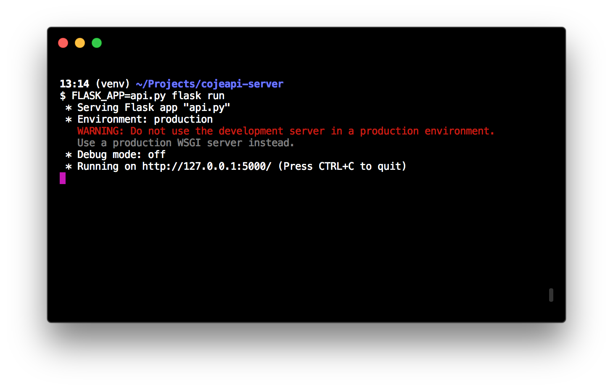
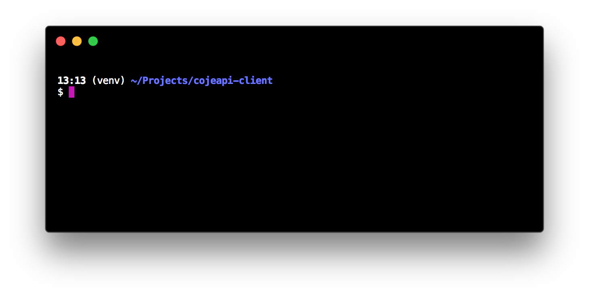

Tvoříme klienta
===============

Doteď jsme používali obecného klienta v podobě prohlížeče nebo programu curl. Obecného klienta musí ovládat člověk. To je přesně to, co potřebujeme, když si chceme nějaké API vyzkoušet, ale celý smysl API je v tom, aby je programy mohly využívat automaticky.

Základ aplikace
---------------

Pokud chceme naprogramovat klienta pro konkrétní úkol, můžeme ve většině jazyků použít nějakou buďto vestavěnou, nebo doinstalovanou knihovnu. V případě jazyka Python použijeme Requests.

Vytvoříme si pro náš projekt nový adresář ``cojeapi-client`` a v něm `virtuální prostředí <https://naucse.python.cz/course/pyladies/beginners/venv-setup/>`__, které si aktivujeme. Poté nainstalujeme Requests:

.. code-block:: shell

    (venv)$ pip install requests

Pokud jste prošli :ref:`kapitolou o tvorbě API serveru <creating-server>`, ujistěte se, že pro klienta si vytváříte nový projekt - novou složku, nové virtuální prostředí, atd. Vytváříme novou, na serveru zcela nezávislou a samostatnou aplikaci!

Nyní můžeme začít s tvorbou klienta. Jenže specializovaný klient potřebuje nějaké API, na které by se mohl specializovat. K tomu se nám náramně hodí API z předešlé kapitoly. V jednom příkazovém řádku si naše API spustíme:

V druhém příkazovém řádku začneme vytvářet klienta, který na něj bude posílat dotazy:

V adresáři ``cojeapi-client`` si vytvoříme nový soubor s názvem ``client.py`` a použijeme v něm Requests pro jednoduchý dotaz na server. Funkce `requests.get <http://docs.python-requests.org/en/master/api/#requests.get>`__ nám umožní poslat dotaz metodou ``GET``. Naše API běží a je dostupné na adrese ``http://127.0.0.1:5000/``, takže ji použijeme jako cíl dotazu. Následně vypíšeme detaily odpovědi, kterou dostaneme:

.. code-block:: python

    import requests

    response = requests.get("http://127.0.0.1:5000/")

    print(response.status_code)
    print(response.headers)
    print(response.text)

Napsali jsme program, který je ekvivalentem následujícího příkazu:

.. code-block:: text

    $ curl "http://127.0.0.1:5000/"

Zkusme jej spustit, zatímco nám ve vedlejším okně jede naše API:

.. code-block:: text

    (venv)$ python client.py
    200
    {'Content-Type': 'application/json', 'Content-Length': '151', 'Server': 'Werkzeug/0.14.1 Python/3.7.1', 'Date': 'Sat, 10 Nov 2018 12:23:57 GMT'}
    {"eyes_color":"brown","eyes_count":2,"hair_color":"brown","hands_count":2,"legs_count":2,"mood":"grumpy","name":"Honza","surname":"Javorek"}

A je to, udělali jsme svůj první dotaz na server! Vidíme, že se nám povedlo vypsat status kód odpovědi, hlavičky, i tělo. Hlavičky nám Requests rovnou poskytují jako Python `slovník <https://naucse.python.cz/course/pyladies/sessions/dict/>`__. Tělo odpovědi ale máme zatím jako řetězec.

Čteme JSON
----------

Je vidět, že text, který obsahuje tělo odpovědi, je ve formátu JSON. To potvrzuje i hlavička ``Content-Type``, která hlásá ``application/json``. Nešlo by tělo také dostat nějak jednoduše jako slovník? Šlo - přesně na toto mají Requests metodu `Response.json <http://docs.python-requests.org/en/master/api/#requests.Response.json>`__:

.. code-block:: python
    :emphasize-lines: 7

    import requests

    response = requests.get("http://127.0.0.1:5000/")

    print(response.status_code)
    print(response.headers)
    print(response.json())

Nyní máme z textu ve formátu JSON obyčejný Python slovník:

.. code-block:: text

    (venv)$ python client.py
    200
    {'Content-Type': 'application/json', 'Content-Length': '151', 'Server': 'Werkzeug/0.14.1 Python/3.7.1', 'Date': 'Sat, 10 Nov 2018 12:23:57 GMT'}
    {'eyes_color': 'brown', 'eyes_count': 2, 'hair_color': 'brown', 'hands_count': 2, 'legs_count': 2, 'mood': 'comfortably numb', 'name': 'Honza', 'surname': 'Javorek'}

Zpracováváme odpověď
--------------------

Program, který dělá totéž co curl, není popravdě moc užitečný program. Pojďme zkusit využít naše API k napsání programu, jenž z něj zjistí náladu člověka a vypíše ji.

.. code-block:: python

    import requests

    response = requests.get("http://127.0.0.1:5000/")
    data = response.json()
    print("{name} {surname} is {mood}".format(**data))

.. code-block:: text

    $ python client.py
    Honza Javorek is comfortably numb

Protože je nálada proměnlivá, měl by program pokaždé vypsat jinou:

.. code-block:: text

    $ python client.py
    Honza Javorek is cheerful

Specializované knihovny (SDK)
-----------------------------

.. warning::
    Tato kapitola není ještě připravena.

.. todo::
    vysvětlit specializovaného klienta
    příklady

.. todo::
    připomenout, že než jdeme psát klienta na zelené louce, měli bychom ověřit, že už není nějaká hotová SDK knihovna (příklady z pypi)

    základní příklady s requests, GET, POST
    https://github.com/honzajavorek/cojeapi/issues/2

Zabezpečení
-----------

.. warning::
    Tato kapitola není ještě připravena.

.. todo::
    mechanismus http/https
    basic auth
    oauth
    většinou nějaký token (vysvětlit token), který se narve do hlavičky
    auth token - něco vygenerováno jen pro nás, co je tajné a neměli bychom to nikomu dávat a ukazovat

    příklad s GitHubem, vygenerujeme token, dáme do ENV, nasosáme v programu a můžeme použít

Kódování parametrů
------------------

.. warning::
    Tato kapitola není ještě připravena.

.. todo::
    co dáváme do parametrů se musí prohnat nějakym urlencoding
    příklady s nějakým (reverse) geocoding api (google, seznam?)

