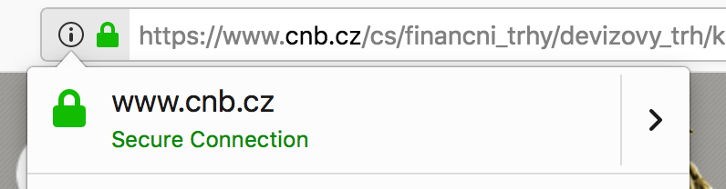
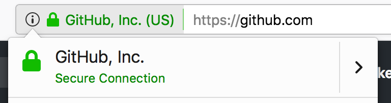

Základní pojmy
==============

Než se ponoříme do samotné tvorby klienta nebo serveru, je dobré pochopit některé základní pojmy kolem API.

Protokol
--------

Celé dorozumívání mezi klientem a serverem se odehrává přes tzv. protokol. To není nic jiného, než smluvený způsob, co bude kdo komu posílat a jakou strukturu to bude mít. Protokolů je v počítačovém světě spousta, ale nás bude zajímat jen `HTTP <https://cs.wikipedia.org/wiki/Hypertext_Transfer_Protocol>`__, protože ten využívají webová API a ostatně i web samotný. Není to náhoda, že adresa internetových stránek v prohlížeči zpravidla začíná ``http://`` (nebo ``https://``).

HTTP
~~~~

Jak jsme mohli pozorovat i na předchozích příkladech, dorozumívání mezi klientem a serverem probíhá formou dotazu (*HTTP request*), jenž posílá klient na server, a odpovědi (*HTTP response*), kterou server posílá zpět. Každá z těchto zpráv má své náležitosti.

.. _http-request:

Součásti dotazu
^^^^^^^^^^^^^^^

Dotaz může vypadat nějak takto::

    GET http://api.example.com/movies?genre=drama&duration=150

Přesně takové dotazy jsme posílali v předchozích příkladech v prohlížeči nebo s ``curl``. Dotaz ale může vypadat i takto:

.. code-block:: text

    POST http://api.example.com/movies

    User-Agent: cojeapi/1.0 (+http://cojeapi.cz)
    Authorization: c630c64829efbd162eeb5f9e9f878e9ef3fcf757
    Content-Type: application/json

    {
      "title": "Ariel",
      "director": "Aki Kaurismäki",
      "year": 1988,
      "duration": 73
    }

Takový dotaz bychom už nemohli poslat přes prohlížeč, protože má více částí, ne jen adresu. Šlo by jej ale poslat s pomocí curl a jeho přepínačů. Které části dotazu jsou povinné, co vše v nich lze poslat, a k čemu jednotlivé části jsou?

metoda (*HTTP method*, někdy také *HTTP verb*)
    Protokol HTTP `přesně vysvětluje všechny metody <https://developer.mozilla.org/en-US/docs/Web/HTTP/Methods>`__ a jaké má jejich použití důsledky pro dotaz i odpověď. Například metoda ``GET`` má tu vlastnost, že provádí pouze čtení a nemůžeme s ní tedy přes API něco změnit - je tzv. *bezpečná*. Metody ``PUT`` nebo ``DELETE`` zase dávají záruku, že i když je pošleme několikrát za sebou, dostaneme vždy stejnou odpověď.

    Příklady: ``GET``, ``POST``, ``PUT``, ``DELETE``, a další

adresa s parametry (*URL* s *query parameters*)
    S URL adresou se běžně setkáváme na internetu, takže ji asi není potřeba velmi představovat. V kontextu API je zajímavé, že na konci adresy může být otazník a za ním parametry. Pokud je parametrů víc, oddělují se znakem ``&``.

    Příklady:

    -   ``http://api.example.com/movies/``
    -   ``http://api.example.com/movies?genre=drama&duration=150``

    .. note::
        Někdy můžete narazit na to, že se adresa označuje jako URI místo URL. Teoreticky mezi URI a URL existuje jemný rozdíl, ale v praxi ho nikdo nezná a obě zkratky označují totéž.

hlavičky (*headers*)
    Hlavičky jsou vlastně jen další parametry. Liší se v tom, že je neposíláme jako součást adresy a na rozdíl od URL parametrů podléhají nějaké standardizaci a konvencím.

    Příklady:

    -   ``Date: Thu, 25 Oct 2018 09:29:48 GMT``
    -   ``Content-Type: text/plain``

tělo (*body*)
    Tělo zprávy je krabice, kterou s dotazem posíláme, a do které můžeme vložit, co chceme. Tedy nejlépe něco, čemu bude API na druhé straně rozumět. Tělo může být prázdné. V těle můžeme poslat obyčejný text, data v nějakém formátu, ale klidně i obrázek. Aby API na druhé straně vědělo, co v krabici je a jak ji má rozbalovat, je potřeba s tělem zpravidla posílat hlavičku ``Content-Type``.

    Příklady: ``Ahoj!``, ``{"title": "Ariel"}``

Když chceme poslat dotaz, musíme nejdříve vyčíst z dokumentace API, jak jej máme správně položit tak, aby API vrátilo co chceme.

.. _http-response:

Součásti odpovědi
^^^^^^^^^^^^^^^^^

Odpověď typicky vypadá následovně:

.. code-block:: text

    201 Created

    Content-Type: application/json
    Location: http://api.example.com/movies/78903

    {
      "id": 78903,
      "title": "Ariel",
      "director": "Aki Kaurismäki",
      "year": 1988,
      "duration": 73
    }

Pojďme si opět popsat jednotlivé součásti.

status kód (*status code*)
    Číselný kód, kterým API dává najevo, jak dotaz zpracovalo. Někdy se s ním objevuje i tzv. *reason phrase*, která kód vysvětluje slovy. Každý kód má zpravidla svou přesně danou *reason phrase*, takže ta neposkytuje žádnou informaci navíc, ale kódy se s ní lépe čtou. Protokol HTTP `přesně určuje všechny kódy <https://developer.mozilla.org/en-US/docs/Web/HTTP/Status>`__, co znamenají, a kdy se mají použít. Podle první číslice kódu se kódy dělí na různé kategorie:

    -   1xx - informativní odpověď (dotaz byl přijat, ale jeho zpracování pokračuje)
    -   2xx - dotaz byl v pořádku přijat a zpracován
    -   3xx - přesměrování, klient potřebuje poslat další dotaz jinam, aby se dobral odpovědi
    -   4xx - chyba na straně klienta (špatně jsme poskládali dotaz)
    -   5xx - chyba na straně serveru (API nezvládlo odpovědět)

    Příklady kódů i s jejich *reason phrases*: ``404 Not Found``, ``200 OK``, ``500 Internal Server Error``, ``201 Created``

hlavičky (*headers*)
    Totéž jako u :ref:`dotazu <http-request>`.

    Příklady:

    -   ``Date: Thu, 25 Oct 2018 09:29:48 GMT``
    -   ``Content-Type: text/plain``

tělo (*body*)
    Totéž jako u :ref:`dotazu <http-request>`.

    Příklady: ``Ahoj!``, ``{"title": "Ariel"}``

.. _curl-lowercase-i:

Posílat základní dotazy přes prohlížeč nebo curl už umíme. Z odpovědí nám ale bylo v obou případech zobrazeno jen tělo. Pokud bychom se chtěli s programem curl podívat i na ostatní části odpovědi, můžeme to udělat pomocí přepínače ``-i``:

.. code-block:: text
    :emphasize-lines: 3-10

    $ curl -i 'http://www.cnb.cz/cs/financni_trhy/devizovy_trh/kurzy_devizoveho_trhu/denni_kurz.txt'
    HTTP/1.1 200 OK
    Date: Fri, 02 Nov 2018 18:40:42 GMT
    Server: Apache-Coyote/1.1
    Last-Modified: Fri, 02 Nov 2018 18:40:00 GMT
    Expires: Fri, 02 Nov 2018 18:45:00 GMT
    Cache-Control: max-age=86400
    Content-Type: text/plain;charset=UTF-8
    Content-Length: 976
    X-FRAME-OPTIONS: SAMEORIGIN

    02.11.2018 #212
    země|měna|množství|kód|kurz
    Austrálie|dolar|1|AUD|16,273
    Brazílie|real|1|BRL|6,109
    Bulharsko|lev|1|BGN|13,183
    ...

Jak jde vidět, hned za verzí protokolu (HTTP/1.1) nám curl vypíše status kód a jeho slovní označení (200 OK), díky kterým víme, že se vše povedlo. Následují všelijaké hlavičky a po nich, odděleno novým řádkem, pokračuje tělo odpovědi, které už známe.

HTTPS
~~~~~

Dotaz i odpověď se po internetu posílají jako obyčejný text, takže by se v nich nemělo posílat nic tajného.

Ve skutečnosti ale prakticky vždy potřebujeme poslat něco tajného, ať už jsou to soukromá data uživatelů, nebo přímo nějaké heslo. Toto se řeší tak, že se textové HTTP zprávy obalí do nějaké bezpečné šifry, která funguje jako "neprůhledný obal".

Kurzy ČNB jsou sice veřejná informace, ale zase chceme mít jistotu, že je publikovala opravdu ČNB, že je nikdo nepodvrhl. ČNB nám bohužel tuto jistotu neposkytuje. Vidíme, že šifrujeme a nemusíme se tedy bát posílat hesla, ale nevíme komu je posíláme:

Když jdeme na nějakou jinou známější stránku, třeba `GitHub <https://github.com>`__, prohlížeč nám v adresním řádku zvýrazňuje, že stránky patří firmě *GitHub, Inc*. To už působí lépe! Je to možné díky ověřování přes tzv. certifikáty.

Šifry, certifikáty, a další bezpečnostní opatření byly do HTTP dodány dodatečně. Souhrnně se označují jako HTTPS (*S* jako *secure*). Vždy bychom se měli snažit, ať už v prohlížeči nebo při práci s API, aby naše adresy začínaly ``https://``. Jen tak zaručíme alespoň minimální bezpečnost toho, co děláme. Zároveň **nikdy** nesmíme posílat žádná hesla přes prosté HTTP!

Možná snad jen pokud bychom chtěli `v televizi říct, že jsme nikdy nešifrovali <https://youtu.be/wnR8LNs1S_c?t=53>`__.

.. _formaty:

Formáty
-------

Dotaz i odpověď mohou obsahovat tělo. Toto tělo může být v libovolném formátu. Může to být text, HTML, obrázek, PDF soubor, nebo cokoliv jiného. Aby druhá strana věděla, co v těle zprávy posíláme, měli bychom jí dát formát vědět v hlavičce ``Content-Type``.

MIME
~~~~

Hodnotě hlavičky ``Content-Type`` se dávají různé názvy: *content type*, *media type*, *MIME type*. Nejčastěji se skládá jen z typu a podtypu, které se oddělí lomítkem (celá specifikace je k dispozici na `MND web docs <https://developer.mozilla.org/en-US/docs/Web/HTTP/Basics_of_HTTP/MIME_types>`__). Několik příkladů:

- ``text/plain`` - obyčejný text
- ``text/html`` - HTML
- ``text/csv`` - `CSV <https://cs.wikipedia.org/wiki/CSV>`__
- ``image/gif`` - GIF obrázek
- ``image/jpeg`` - JPEG obrázek
- ``image/png`` - PNG obrázek
- ``application/json`` - :ref:`JSON`
- ``application/xml`` nebo ``text/xml`` - :ref:`XML`

Na hlavičku se můžeme snadno podívat s pomocí ``curl -i``, které :ref:`už známe <curl-lowercase-i>`, ale to nám bude vracet i tělo odpovědi a to nás teď příliš nezajímá. Pokud místo ``-i`` použijeme ``-I``, uvidíme pouze hlavičky:

.. code-block:: text
    :emphasize-lines: 8

    $ curl -I 'http://www.cnb.cz/cs/financni_trhy/devizovy_trh/kurzy_devizoveho_trhu/denni_kurz.txt'
    HTTP/1.1 200 OK
    Date: Fri, 09 Nov 2018 15:31:46 GMT
    Server: Apache-Coyote/1.1
    Last-Modified: Fri, 09 Nov 2018 15:30:00 GMT
    Expires: Fri, 09 Nov 2018 15:35:00 GMT
    Cache-Control: max-age=86400
    Content-Type: text/plain;charset=UTF-8
    Content-Length: 976
    X-FRAME-OPTIONS: SAMEORIGIN

Vidíme, že :ref:`API ČNB <cnb>` vrací obyčejný text, tedy ``text/plain`` (přilepeného ``;charset=UTF-8`` si teď nebudeme všímat).

.. tabs::

    .. group-tab:: Cvičení

        Jaký ``Content-Type`` má tělo odpovědí z následujících adres?

        #. ``https://www.gravatar.com/avatar/7b2e4bf7ecca28e530e1c421f0676c0b?s=120``
        #. ``https://feeds.feedburner.com/respekt-clanky``
        #. ``https://www.omdbapi.com/?t=westworld``
        #. ``https://duckduckgo.com/``

    .. group-tab:: Řešení

        Postupně spouštíme ``curl -I`` (nebo ``curl -i``) pro jednotlivé adresy a ve vypsaných hlavičkách hledáme hodnotu pro ``Content-Type``. Měli bychom dostat následující:

        #. JPEG - ``image/jpeg``
        #. :ref:`XML` - ``text/xml; charset=UTF-8``
        #. :ref:`JSON` - ``application/json; charset=utf-8``
        #. HTML - ``text/html; charset=UTF-8``

.. _struktura:

Struktura a strojová čitelnost
~~~~~~~~~~~~~~~~~~~~~~~~~~~~~~

Tělo HTTP zprávy může být v jakémkoliv formátu, ale jak jsme si :ref:`vysvětlili v úvodu <chmu>`, smyslem API je, aby se jím propojené systémy obešly bez člověka. Potřebujeme tedy strojovou čitelnost. Řekněme, že budeme chtít v API poslat seznam adres. Následující řádky budou sice jasné nám, lidem, ale program si s nimi poradí jen těžko:

.. code-block:: text

    Roadway Cafe & Beer, 144/15B Phan Văn Hân, Phường 17, Bình Thạnh, Hồ Chí Minh, Vietnam
    Kuma Sushi + Sake, 1040 Polk St, San Francisco, CA 94109, USA
    Madam Podprsenka, Hybešova 437/46, 602 00 Brno-střed, Česká republika

Potřebujeme těmto datům dát nějakou strukturu. Třeba takto:

.. code-block:: text

    Název: Roadway Cafe & Beer
    Ulice: 144/15B Phan Văn Hân
    Část: Phường 17, Bình Thạnh
    Město: Hồ Chí Minh
    Země: Vietnam

    Název: Kuma Sushi + Sake
    Ulice: 1040 Polk St
    Město: San Francisco
    Stát: CA
    ZIP/PSČ: 94109
    Země: USA

    Název: Madam Podprsenka
    Ulice: Hybešova 437/46
    Část: Brno-střed
    Město: Brno
    ZIP/PSČ: 60200
    Země: Česká republika

V tomto okamžiku už by program mohl mít nějakou představu o tom, co mu posíláme a jak to má přečíst. Jenže aby to přečetl, musí jít řádek po řádku a nějak zpracovat tento náš formát, který jsme si právě vymysleli. Musí vědět, že jednotlivé adresy jsou oddělené více novými řádky, že názvy položek jsou odděleny dvojtečkou, atd.

Protože by to bylo pro obě strany dost pracné, existují formáty, které slouží k přenosu obecných strukturovaných dat. Většina programovacích jazyků s nimi navíc umí pracovat bez velkých potíží. Například :ref:`JSON`:

.. code-block:: json

    [
        {
            "name": "Roadway Cafe & Beer",
            "street": "144/15B Phan Văn Hân",
            "district": "Phường 17, Bình Thạnh",
            "city": "Hồ Chí Minh",
            "country": "Vietnam"
        },
        {
            "name": "Kuma Sushi + Sake",
            "street": "1040 Polk St",
            "city": "San Francisco",
            "state": "CA",
            "zip": 94109,
            "country": "USA"
        },
        {
            "name": "Madam Podprsenka",
            "street": "Hybešova 437/46",
            "district": "Brno-střed",
            "city": "Brno",
            "zip": 60200,
            "country": "Česká republika"
        }
    ]

Názvy položek jsme přeložili do angličtiny ne proto, že bychom museli, ale proto že je to zažitá konvence a zjednodušuje to přenositelnost dat mezi programy. Nyní může jakýkoliv program taková data snadno přečíst. Pojďme si to hned zkusit!

Uložíme tento JSON na disk a zkusíme jej zpracovat v jazyce Python:

#.  Uložte JSON z příkladu do souboru ``places.json``
#.  V tomtéž adresáři vytvořte program ``places.py``:

    .. code-block:: python

        import json

        with open("places.json", encoding="utf8") as f:
            places = json.load(f)

        for place in places:
            print("{name} ({country})".format_map(place))

#.  Spusťte program:

    .. code-block:: text

        $ python places.py
        Roadway Cafe & Beer (Vietnam)
        Kuma Sushi + Sake (USA)
        Madam Podprsenka (Česká republika)

Na několika řádcích jsme byli v Pythonu schopni JSON soubor načíst a s daty v něm dále pracovat.

.. note::
    Koho právě napadlo, že :ref:`API ČNB <cnb>` vypadá jako adresy v druhém příkladu, dostává bludišťáka! Je to tak. Bylo by lepší, kdyby ČNB kurzy posílala jako :ref:`JSON` a ne jen jako strukturovaný text.

.. _json:

JSON
~~~~

Příklad dat ve formátu JSON už jsme si ukázali :ref:`výše <struktura>`. JSON vznikl kolem roku 2000 a brzy se uchytil jako stručnější náhrada za :ref:`XML`, především na webu a ve webových API. Dnes je to nejspíš nejoblíbenější formát pro obecná strukturovaná data vůbec. Jeho autorem je `Douglas Crockford <https://en.wikipedia.org/wiki/Douglas_Crockford>`__, jeden z lidí podílejících se na vývoji jazyka JavaScript.

Jazyk Python (a mnoho dalších) má podporu pro práci s JSON `přímo zabudovanou <https://docs.python.org/3/library/json.html>`__. JSON je navržený tak, aby připomínal objekt jazyka JavaScript. Začátečníkům se pak snadno stane, že neví, co je co.

V případě jazyka Python si lze JSON splést především se `slovníkem <https://naucse.python.cz/course/pyladies/sessions/dict/>`__. Je ale potřeba si uvědomit, že **JSON je text**, který může být uložený do souboru nebo odeslaný přes HTTP, ale nelze jej přímo použít při programování. Musíme jej vždy nejdříve zpracovat na slovníky a seznamy:

.. code-block:: python

    >>> address_json = '{"name": "Roadway Cafe & Beer", "country": "Vietnam"}'
    >>> address_json
    '{"name": "Roadway Cafe & Beer", "country": "Vietnam"}'
    >>> type(address_json)
    <class 'str'>

    >>> import json
    >>> address_dict = json.loads(address_json)
    >>> address_dict
    {'name': 'Roadway Cafe & Beer', 'country': 'Vietnam'}
    >>> type(address_dict)
    <class 'dict'>

Naopak slovníky a seznamy se hodí při programování, ale zase je nemůžeme jen tak uložit do souboru nebo odeslat přes HTTP. Je potřeba je nejdříve *serializovat* do nějakého textového formátu - což může být zrovna JSON:

.. code-block:: python

    >>> address_dict = {'name': 'Roadway Cafe & Beer', 'country': 'Vietnam'}

    >>> import json
    >>> address_json = json.dumps(address_dict)
    >>> address_json
    '{"name": "Roadway Cafe & Beer", "country": "Vietnam"}'
    >>> type(address_json)
    <class 'str'>

.. _xml:

XML
~~~

XML vzniklo kolem roku 1997. Mnoho lidí nad ním dnes ohrnuje nos, protože si jej spojuje s velkými korporacemi, jazykem Java, :ref:`SOAP`, apod., ale v době vzniku bylo XML přelomovou technologií a dodnes se na spoustě míst využívá ke spokojenosti všech zúčastněných. Je například základem pro populární formáty jako jsou `GPX <https://en.wikipedia.org/wiki/GPS_Exchange_Format>`__, `KML <https://en.wikipedia.org/wiki/Keyhole_Markup_Language>`__, `SVG <https://en.wikipedia.org/wiki/Scalable_Vector_Graphics>`__, `DocBook <https://en.wikipedia.org/wiki/DocBook>`__, a další. Zajímavostí také je, že jedna z nejvýznamnějších XML konferencí na světě se každoročně koná u nás: `XML Prague <http://www.xmlprague.cz/>`__

XML vypadá podobně jako HTML, ale je obecnější a přísnější. Na rozdíl od HTML, které přímo popisuje význam značek (např. že ``
Ahoj!
`` má prohlížeč interpretovat jako odstavec s textem ``Ahoj!``), XML určuje pouze obecná pravidla o tvaru značek samotných a zbytek je plně na nás. :ref:`Náš příklad <struktura>` s adresami by v XML mohl vypadat třeba takto:

.. code-block:: xml

    <places>
        <place>
            <name>Roadway Cafe &amp; Beer</name>
            <street>144/15B Phan Văn Hân</street>
            <district>Phường 17, Bình Thạnh</district>
            <city>Hồ Chí Minh</city>
            <country>Vietnam</country>
        </place>
        <place>
            <name>Kuma Sushi + Sake</name>
            <street>1040 Polk St</street>
            <city>San Francisco</city>
            <state>CA</state>
            <zip>94109</zip>
            <country>USA</country>
        </place>
        <place>
            <name>Madam Podprsenka</name>
            <street>Hybešova 437/46</street>
            <district>Brno-střed</district>
            <city>Brno</city>
            <zip>60200</zip>
            <country>Česká republika</country>
        </place>
    </places>

Jazyk Python (a mnoho dalších) má podporu pro práci s XML `přímo zabudovanou <https://docs.python.org/3/library/xml.etree.elementtree.html>`__.

Typy API
--------

Přes HTTP je možné poslat prakticky cokoliv. Zatímco některá API se snaží maximálně využít jeho možností a vlastností, jiná jej využívají pouze jako "dopravní prostředek". Podle přístupu dělíme API na následující typy.

.. _soap:

SOAP
~~~~

Tato API si přes HTTP posílají zprávy zabalené do přesně specifikovaného, ale velmi nepřehledného chuchvalce :ref:`XML` obálek. SOAP se používá hlavně ve světě velkých aplikací napsaných v jazyce Java, a to především v prostředí korporací a velkých institucí. SOAP API se objevila kolem roku 1998 a byla v módě během první dekády 21. století. Blízkými příbuznými SOAP jsou API typu RPC (XML-RPC, JSON-RPC).

Čtení pro pokročilé
^^^^^^^^^^^^^^^^^^^

- `Phil Sturgeon: Understanding RPC Vs REST For HTTP APIs <https://www.smashingmagazine.com/2016/09/understanding-rest-and-rpc-for-http-apis/>`__
- `Leonard Richardson, Sam Ruby: RESTful Web Services <http://shop.oreilly.com/product/9780596529260.do>`__

.. _rest:

REST
~~~~

API, která lidé označují jako REST, jsou dnes nejběžnější. Snaží se co nejvíce spolehnout na schopnosti a vlastnosti samotného HTTP. Na rozdíl od :ref:`SOAP` nebo :ref:`GraphQL` není REST přesně specifikovaný, je to pouze "styl" jak API dělat. Je to jako styly v architektuře budov - stavitelé gotických kostelů neměli přesně přikázáno, jak má co vypadat, ale přesto dnes poznáme, který kostel je gotický a který barokní. REST API dnes používají především :ref:`JSON`, ale je to pouze zvyklost, nebo možná také jen náhoda (REST i JSON začaly být populární ve stejné době).

Historie
^^^^^^^^

REST se poprvé objevil v roce 2000 v dizertační práci `R. Fieldinga <https://en.wikipedia.org/wiki/Roy_Fielding>`__ (spoluautor HTTP). Ten pozoroval jak funguje web, a snažil se přijít na to, co jej dělá tak úspěšným. Jaké má web zásadní vlastnosti a omezení, a zda jsou za tím nějaké obecné principy, které by šlo využít i jinde. Tyto principy pak popsal a přisoudil jim zkratku REST.

Na REST principech se začala stavět API a ta pak ze scény vytlačovala SOAP. Jenže ze zkratky REST se stal `buzzword <https://cs.wikipedia.org/wiki/Buzzword>`__ a lidé jí začali označovat vše, co používalo HTTP a nebylo to SOAP. Samozřejmě bez ohledu na původní principy.

Zastánci původních principů se nevzdávali a zkoušeli postupně prorazit s několika termíny, které měly odlišit pravověrnost: RESTful, HATEOAS, hypermedia. Dodnes je ale takovýchto pravověrných API málo. Rozjetý vlak s tím, jak si lidé REST vyložili, už se nepovedlo zastavit.

Čtení pro pokročilé
^^^^^^^^^^^^^^^^^^^

- `Leonard Richardson, Sam Ruby, Mike Amundsen: RESTful Web APIs <http://shop.oreilly.com/product/0636920028468.do>`__

.. _graphql:

GraphQL
~~~~~~~

`GraphQL <https://graphql.org/>`__ je nejnovějším typem API a momentálně i nejžhavějším `buzzwordem <https://cs.wikipedia.org/wiki/Buzzword>`__ konferencí. Má přesně danou specifikaci a HTTP používá jenom jako "dopravní prostředek", podobně jako dříve SOAP nebo RPC. Jeho největšími fanoušky jsou vývojáři klientů, a to především v jazyce JavaScript. GraphQL nejvíce připomíná dotazovací jazyk pro databáze a je pevně spjato s formátem :ref:`JSON`.

Historie
^^^^^^^^

Dá se říci, že lidé se utopili ve volnosti výkladu co je REST a nedostatku striktních doporučení jak přesně mají REST API vytvářet. Návrh REST API vyžaduje detailní znalosti HTTP, kreativitu a smysl pro architekturu. Běžný vývojář ovšem není ochotný řádně nastudovat ani jak přesně funguje HTTP, natož přemýšlet nad architekturou - raději to "prostě nějak splácá". Výsledek je většinou frustrující, především pro vývojáře klientů (frontend, mobilní aplikace, apod.), kteří s API musí pracovat.

GraphQL vymyslel `Facebook <https://cs.wikipedia.org/wiki/Facebook>`__ pro svoje potřeby a v roce 2015 jej uveřejnil jako specifikaci, kterou může využít každý. Vývojáři klientů po GraphQL lačně chňapli jako po řešení všech jejich problémů. Podle obsahu technologických konferencí by se v roce 2018 zdálo, že REST už nikoho nezajímá. GraphQL každým rokem nabírá větší a větší momentum.

Podle odborníků to ale nevypadá, že by GraphQL mělo REST nahradit. Spíše se zdá, že budou existovat společně a doplňovat se. Používat nebo vyvíjet GraphQL mimo JavaScript je navíc stále zatím dost obtížné kvůli chybějícím nástrojům a knihovnám, ale to se samozřejmě může časem změnit.

Čtení pro pokročilé
^^^^^^^^^^^^^^^^^^^

- `Phil Sturgeon: GraphQL vs REST: Overview <https://philsturgeon.uk/api/2017/01/24/graphql-vs-rest-overview/>`__
- `Zdeněk Němec: REST vs. GraphQL: A Critical Review <https://goodapi.co/blog/rest-vs-graphql>`__

Která API se učíme?
-------------------

**Co je API?** je primárně o těch API, která se běžně označují jako :ref:`REST`. Vzhledem k historii a komplikovanosti termínu REST API se mu ale záměrně vyhýbám a raději tato API označuji jako webová. Přijde mi to tak i přesnější a srozumitelnější.

V těchto materiálech se nebudeme zabývat :ref:`SOAP` ani RPC. Zatím zde není nic ani o :ref:`GraphQL`. Pokud vás to mrzí a o GraphQL něco víte, budu rád, když do materiálů :ref:`přispějete <jak-prispivat>`.

Shrnutí
-------

.. todo::
    víceméně hlavně přehledový obrázek jak se to všechno k sobě má
