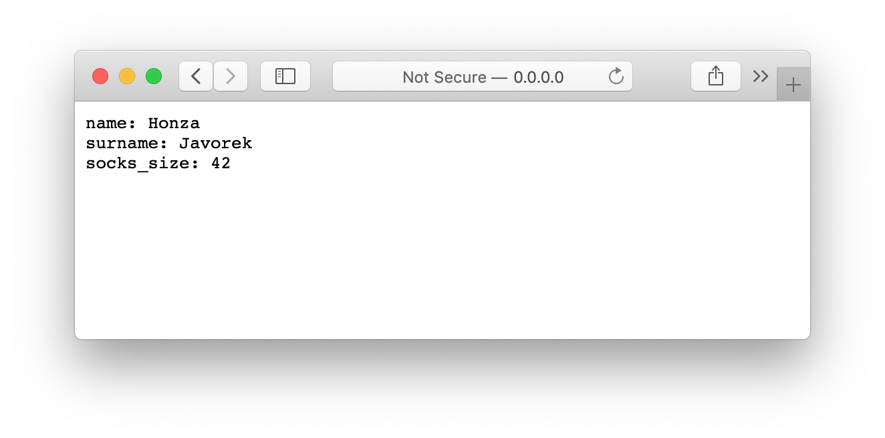
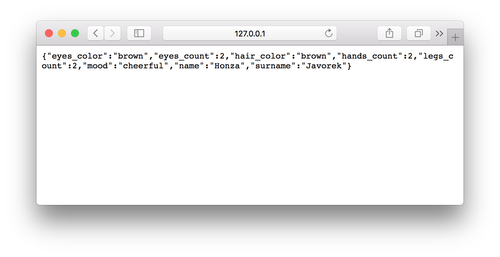
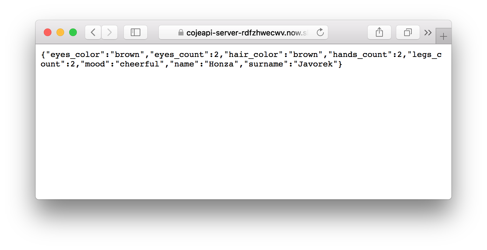

.. _creating-server:

Tvoříme server
==============

Konec teorie, pojďme si vyzkoušet nabyté znalosti v praxi. Začneme tím, že zkusíme vyrobit API. Použijeme k tomu jazyk `Python <https://python.cz/>`__ verze 3 a framework `Falcon <https://falcon.readthedocs.io/>`__, který se pro API skvěle hodí.

.. note::

    Pokud vám Python není cizí, možná jste už slyšeli o známějších frameworcích `Flask <http://flask.pocoo.org/>`__ nebo `Django <https://www.djangoproject.com/>`__. V těch by šlo API vytvořit také, ale jsou primárně určeny na tvorbu webových stránek, a to by nám nyní spíš překáželo. Viz také kapitola :ref:`frameworky`.

Vytvoříme si pro náš projekt nový adresář ``cojeapi-server`` a v něm `virtuální prostředí <https://naucse.python.cz/course/pyladies/beginners/venv-setup/>`__, které si aktivujeme. Poté nainstalujeme Falcon:

.. code-block:: shell

    (venv)$ pip install falcon

Navrhujeme API
--------------

Nyní budeme tvořit API, které bude strojově čitelnou formou zpřístupňovat základní informace o nás samotných. Pokud jsme aktivní na sociálních sítích, tak takové API nejspíš už `existuje <https://developers.facebook.com/docs/graph-api/>`__, ale my si uděláme svoje - roztomilejší, jednodušší, méně `děsivé <https://en.wikipedia.org/wiki/Facebook#Criticisms_and_controversies>`__.

Než začneme cokoliv programovat, rozmyslíme si, jak by naše API mělo vypadat. Řekněme, že kdybychom na něj poslali :method:`get` požadavek pomocí programu curl, chceme, aby naše API odpovědělo zhruba následovně:

.. literalinclude:: ../code/base_example.txt
    :language: text
    :class: example

Jinými slovy, pokud metodou :method:`get` přijde :ref:`požadavek <http-request>` na adresu ``/``, pošleme zpátky :ref:`odpověď <http-response>` se status kódem :status:`200` a tělem v textovém :ref:`formátu <formaty>`. V těle zprávy budou tři řádky, v nichž pošleme své jméno, příjmení, a velikost ponožek.

.. note::

    Příklad výše zatím nezkoušejte, je to pouze návrh toho, jak by naše API mělo fungovat.

Programujeme aplikaci
---------------------

Začneme tím, že vytvoříme soubor ``index.py`` s následujícím obsahem:

.. literalinclude:: ../code/base.py
    :language: python

V kódu můžeme vidět `třídu <https://naucse.python.cz/course/pyladies/beginners/class/>`__ ``PersonalDetailsResource`` s jednou metodou. Třídu jsme si pojmenovali sami podle toho, že je zodpovědná za naše osobní údaje, akorát jsme podle konvence připojili slovo *resource*.

Název metody ``on_get()`` naznačuje, že se stará o HTTP metodu :method:`get`. Bere parametry ``request`` reprezentující právě přicházející :ref:`požadavek <http-request>`, a ``response``, tedy :ref:`odpověď <http-response>`, kterou se chystáme odeslat zpět. Uvnitř metody nastavujeme status kód odpovědi na :status:`200`, hlavičku :header:`Content-Type` na formát těla, a poté tělo na tři řádky řetězců s osobními údaji.

Nakonec do proměnné ``app`` ukládáme naši Falcon aplikaci a na dalším řádku jí říkáme, že pokud někdo bude posílat :ref:`požadavky <http-request>` na adresu ``/``, bude je mít na starost naše třída.

Spouštíme aplikaci na našem počítači
------------------------------------

Když zkusíme program spustit, zjistíme, že nic nedělá:

.. code-block:: shell

    (venv)$ python index.py

.. note::

    Jestliže vidíte nějakou chybu, třeba ``SyntaxError`` nebo ``NameError``, tak ji opravte. Abyste mohli pokračovat, program se má spustit, nemá nic vypsat, a má se bez chyb hned ukončit.

Falcon se totiž jen tak sám od sebe spustit neumí. Potřebujeme něco, co načte naši aplikaci a bude se chovat jako :ref:`server <server>`. Takových nástrojů je naštěstí hned několik. Pro účely tohoto návodu si vybereme `Waitress <https://docs.pylonsproject.org/projects/waitress/>`__, protože na rozdíl od jiných funguje i pod Windows. Instalujeme standardně:

.. code-block:: shell

    (venv)$ pip install waitress

Nyní můžeme spustit naše API. Stačí spustit ``waitress-serve`` s nápovědou, kde má hledat aplikaci. Ta je v souboru ``index.py`` v proměnné ``app``, takže nápověda pro Waitress bude ``index:app``.

.. code-block:: shell

    (venv)$ waitress-serve index:app
    Serving on http://0.0.0.0:8080

Waitress nám píše, že na adrese ``http://0.0.0.0:8080`` teď najdeme spuštěné naše API. Bude tam čekat na :ref:`požadavky <http-request>` tak dlouho, dokud v programu nenastane chyba (potom "spadne"), nebo dokud jej v terminálu neukončíme pomocí :kbd:`Ctrl+C`.

Když nyní v prohlížeči půjdeme na adresu ``http://0.0.0.0:8080``, měli bychom vidět očekávanou :ref:`odpověď <http-response>`:

Co když zkusíme curl? Protože nám spuštěné API blokuje terminál, spustíme si další terminál v novém okně. Z něj nyní můžeme spustit curl:

.. image:: ../_static/images/me-api-curl.png
    :alt: Spouštění curl v dalším terminálu
    :align: center

Vidíme, že API se chová tak, jak jsme původně chtěli. Odpověď má status kód :status:`200`, formát těla odpovědi je v hlavičce :header:`Content-Type` nastaven na obyčejný text, a v těle zprávy vidíme jméno, příjmení, i velikost ponožek. Kromě toho Falcon s Waitress přidali i nějaké další hlavičky.

.. literalinclude:: ../code/base_test.txt
    :language: text

Server nyní můžeme v terminálu ukončit pomocí :kbd:`Ctrl+C` a budeme API rozšiřovat o další funkce. Pokaždé, když změníme kód a budeme chtít naše API vyzkoušet, budeme muset Waitress nejdřív restartovat.

Uchováváme data jako slovník
----------------------------

Naše data nyní vypadají následovně:

.. literalinclude:: ../code/base.py
    :language: python
    :emphasize-lines: 9-13

Co si budeme povídat, takto data běžně nevypadají. Většinou jsou někde v databázi, v souboru, apod. Zpravidla je dostaneme jako seznam nebo slovník, ne jako připravený řetězec. Pojďme si tedy tuto situaci nasimulovat. Nejdříve si data vytáhneme do proměnné.

.. literalinclude:: ../code/base_data.py
    :language: python
    :emphasize-lines: 4-8, 16

Nyní z dat uděláme slovník, který až při sestavování odpovědi složíme do textu. Tím rozdělíme uložení dat a jejich prezentaci navenek. Jak už bylo zmíněno, data většinou přicházejí např. z databáze právě jako slovník, takže toto rozdělení je v praxi potřebné a velmi časté.

.. literalinclude:: ../code/base_data_dict.py
    :language: python
    :emphasize-lines: 4-8, 17-20

Takovéto API nám bude fungovat stále stejně, protože ze slovníku opět složí řetězec, který jsme původně posílali v odpovědi. Data jsou nyní ale nezávislá na tom, jak je budeme prezentovat uživateli. Prakticky si tuto výhodu ukážeme v následujících odstavcích.

Posíláme JSON
-------------

Jak jsme si :ref:`vysvětlovali <struktura>`, obyčejný text není nejlepší způsob, jak něco udělat strojově čitelné. Zkusíme tedy poslat naše data jako :ref:`JSON`.

.. literalinclude:: ../code/json_response.py
    :language: python
    :emphasize-lines: 1, 16-17

Jak vidíme, kód se nám s JSONem zjednodušil. Navíc díky tomu, že máme data hezky oddělená od samotného API, nemuseli jsme je nijak měnit. Stačilo změnit způsob, jakým se budou posílat v odpovědi. Když aplikaci spustíme, můžeme opět použít curl nebo prohlížeč a ověřit výsledek.

.. literalinclude:: ../code/json_response_test.txt
    :language: text

A je to, máme své první JSON API! Už teď jsme se dostali dál, než kam se se svým API dostala :ref:`ČNB <cnb>`.

.. note::
    Pokud máte v datech diakritiku, bude zakódována. Kdybych se jmenoval Řehoř, vypadal by můj JSON takto: ``{"name": "\u0158eho\u0159", ...}`` Jestliže se chceme takového kódování zbavit, můžeme při tvorbě JSONu nastavit ``ensure_ascii`` na ``False``. Strojům to bude jedno, ale lidem se to bude lépe číst:

    .. code-block:: python

        response.body = json.dumps(get_personal_details(), ensure_ascii=False)

    Stejně tak je strojům jedno, jestli jsou, nebo nejsou jednotlivé části JSONu hezky odsazené. Pokud chcete, aby vaše API odsazovalo, nastavte parametr ``indent`` na počet mezer (používá se 2 nebo 4):

    .. code-block:: python

        response.body = json.dumps(get_personal_details(), ensure_ascii=False, indent=2)

    Zbytek příkladů nebude tyto možnosti využívat, aby byl kód v ukázkách stručnější.

Protože :ref:`odpovědi <http-response>` mají ve většině případů status kód 200 a protože :ref:`JSON` je nejpoužívanější formát, tak je Falcon ve skutečnosti nastavuje jako výchozí. Můžeme proto zcela vynechat dva řádky z našeho programu a stále bude fungovat tak, jak jsme chtěli:

.. literalinclude:: ../code/json_response_simplified.py
    :language: python
    :emphasize-lines: 14-15

Přidáváme další endpoint
------------------------

Naše API má zatím pouze jednu adresu, na kterou může klient posílat požadavky. V hantýrce programátorů webů by se řeklo, že má jednu "routu" (z anglického *route*). V hantýrce programátorů API by se zase řeklo, že má jeden *endpoint*. No a API s jedním endpointem není nic moc. Přidáme tedy druhý, který bude světu sdělovat seznam filmů, které bychom chtěli vidět.

.. literalinclude:: ../code/movies.py
    :language: python
    :emphasize-lines: 18-29, 34

Když aplikaci spustíme, bude na adrese ``/movies`` vracet seznam filmů.

.. literalinclude:: ../code/movies_test.txt
    :language: text

Kdyby každý měl takovéto API, mohl by někdo vytvořit třeba mobilní appku na organizaci filmových večerů. Dávala by dohromady lidi, kteří jsou poblíž a mají stejné filmy na svých seznamech.

Čteme URL parametry
-------------------

Co kdybychom ale chtěli vidět opravdu hodně filmů? Možná bychom chtěli dát uživatelům našeho API možnost výsledky filtrovat. K tomu se nám mohou hodit :ref:`URL parametry <http-request>`. Chtěli bychom třeba, aby klient mohl udělat požadavek na ``/movies?name=shark`` a tím by našel jen ty filmy, které mají v názvu řetězec ``shark``.

Nejdříve si připravme hledání. Vytvoříme funkci ``filter_movies()`` s parametry ``movies`` a ``name``, která vrátí pouze ty filmy, jejichž název obsahuje hodnotu tohoto parametru, a to bez ohledu na velká a malá písmena. Pokud bude parametr nastaven na ``None``, vrátí všechny filmy.

V následujícím příkladu je použit `cyklus <https://naucse.python.cz/course/pyladies/sessions/loops/>`__, ale kdo zná funkci `filter <https://docs.python.org/3/library/functions.html#filter>`__ nebo `list comprehentions <https://docs.python.org/3/tutorial/datastructures.html#list-comprehensions>`__, může si klidně poradit jinak.

.. literalinclude:: ../code/movies_filter.py
    :language: python
    :pyobject: filter_movies

Nyní potřebujeme přečíst z požadavku parametr a použít jej:

.. literalinclude:: ../code/movies_filter.py
    :language: python
    :emphasize-lines: 26-34, 40-41

Pokud se na náš nový endpoint dotážeme bez parametrů, měl by fungovat stejně jako předtím. Jestliže ale přidáme ``?name=`` do adresy, měla by hodnota parametru filtrovat filmy.

.. literalinclude:: ../code/movies_filter_test.txt
    :language: text

Vidíme, že tentokrát jsme dostali v těle odpovědi jen dva filmy místo čtyř.

Detail filmu
------------

V našem případě má každý film jen název a rok uvedení, ale většinou data nebývají tak strohá. Pojďme si k filmům přidat víc údajů, ať naše "databáze" působí o něco víc realisticky.

Když něco evidujeme, zpravidla tomu přiřadíme nějaké evidenční číslo, abychom to mohli jednoznačně odlišit a případně i rychle najít. Programátoři takovému údaji říkají *unikátní identifikátor*, což zkracují na ID nebo ``id``. Filmy se mohou jmenovat stejně, takže jméno se na to nehodí. Kdybychom měli opravdovou databázi, něco by nám pro každý záznam sama vymyslela, ale takto si musíme poradit sami. Použijeme tedy prostě pořadové číslovky od jedničky.

Kromě ``id`` přidáme každému filmu ještě ``name_cs`` s českým názvem (``cs`` je mezinárodní standardní kód pro `Češtinu <https://cs.wikipedia.org/wiki/Seznam_k%C3%B3d%C5%AF_ISO_639-2>`__), ``imdb_url`` s odkazem na `IMDb <https://www.imdb.com/>`__ a ``csfd_url`` s odkazem na `ČSFD.cz <https://www.csfd.cz/>`__.

.. literalinclude:: ../code/movies_db.py
    :language: python
    :lines: 18-51

Když se podíváme, co nyní vrací naše API, uvidíme o dost více dat:

.. literalinclude:: ../code/movies_db_test.txt
    :language: text

Pokud bychom přidali ještě více údajů a měli v seznamu větší množství filmů, byla by odpověď na endpointu ``/movies`` už možná příliš velká a pro některé uživatele našeho API by tam mohlo být možná až příliš mnoho zbytečných informací. Kdybychom tvořili webové stránky, seznam filmů by nejspíš obsahoval jen základní údaje a zbytek by byl na nějaké stránce s detailem filmu pro ty, které to zajímá. Při tvorbě API je praxe stejná.

Pojďme tedy upravit API tak, aby v seznamu vypisovalo jen ``name`` a odkaz na detail filmu. Nejdříve ale vytvoříme ten, ať máme na co odkazovat. Jako obvykle se zamyslíme nad tím, jak by měl nový endpoint fungovat:

.. literalinclude:: ../code/movies_detail_example.txt
    :language: text
    :class: example

Chceme tedy, abychom mohli na adrese ``/movies/1`` zjistit informace o filmu s ID číslo jedna, na adrese ``/movies/2`` o filmu s ID číslo dvě, atd.

Začneme funkcí ``get_movie_by_id()``, která dostane seznam filmů ``movies`` a identifikátor ``id``. Prohledá seznam a když v něm najde film s daným identifikátorem, vrátí tento film.

.. literalinclude:: ../code/movies_detail.py
    :language: python
    :pyobject: get_movie_by_id

Nyní přidáme další endpoint. To sice už umíme, ale nyní je v tom drobný háček. Potřebujeme totiž obsloužit hned čtyři adresy:

-   ``/movies/1``
-   ``/movies/2``
-   ``/movies/3``
-   ``/movies/4``

Určitě se nám ale nechce přidávat každou zvlášť. Co kdybychom v seznamu měli dvacet filmů? Potřebujeme něco, co by obsloužilo všechny zmíněné adresy.

Falcon nám dává řešení v podobě možnosti zapsat adresu jako "šablonu", podle které bude odchytávat odlišné adresy a směřovat na jeden a ten samý kód pro jejich obsluhu.

.. literalinclude:: ../code/movies_detail.py
    :language: python
    :lines: 78-87

Jak vidíme, pokud zadáme adresu jako ``/movies/{id:int}``, dostane naše metoda ``on_get()`` navíc čtvrtý parametr. V něm bude to, co Falcon v adrese odchytne na místě naší značky ``{id:int}``. První část značky i parametr metody si vhodně pojmenujeme jako ``id``. Druhá část značky Falcon upozorňuje na to, že namísto značky očekáváme pouze celá čísla (*int* odkazuje na vestavěnou funkci ``int()`` a anglické slovo *integer*).

Když nyní spustíme naše API a vyzkoušíme, co vrací na adrese ``/movies/1``, měli bychom dostat informace o prvním filmu v seznamu:

.. literalinclude:: ../code/movies_detail_1_test.txt
    :language: text

Zkuste si to i pro ostatní filmy.

Nenalezeno
----------

Naše API umí hezky odpovídat v případě, že se číslem trefíme do existujícího filmu. Co se ale stane pokud se dotážeme na nějakou hloupost?

.. literalinclude:: ../code/movies_detail_hello_test.txt
    :language: text

Jistě, Falcon díky ``{id:int}`` obsluhuje jen adresy s čísly, takže se za nás postará o odpověď. Vrací :status:`404`, čímž dává uživateli najevo, že se asi spletl, protože na této adrese nic není. Co když se ale dotážeme s číslem, akorát na neexistující film, např. na ``/movies/42``?

.. literalinclude:: ../code/movies_detail_42_test.txt
    :language: text

Tady nám Falcon už nepomůže. Adresu obslouží naše metoda a ta, jak vidíme, nevrací zrovna nejlepší odpověď. Žádný film číslo 42 neexistuje, ale naše API se chová, jako by to nebyl žádný problém. Upravíme třídu ``MovieResource`` tak, aby s touto situací počítala. Pokud funkce ``get_movie_by_id()`` nic nenajde, odpovíme s chybovým status kódem. Tělo posílat žádné nemusíme.

.. literalinclude:: ../code/movies_not_found.py
    :language: python
    :pyobject: MovieResource

Pokud se po této změně dotážeme na neexistující film, měli bychom dostat chybu:

.. literalinclude:: ../code/movies_not_found_42_test.txt
    :language: text

Získávání informací o existujícím filmu by mělo fungovat stejně jako předtím.

.. literalinclude:: ../code/movies_not_found_1_test.txt
    :language: text

V tomto návodu s chybou neposíláme žádné tělo, ale je běžné nějaké poslat a poskytnout v něm uživateli našeho API více informací o tom, co se stalo, např. takto:

.. literalinclude:: ../code/movies_not_found_example.txt
    :language: text
    :class: example

Zatímco status kód :status:`404` je záležitost standardu protokolu :ref:`HTTP`, strukturu těla chybové zprávy jsme si v tomto případě vymysleli. Aby uživatel našeho API věděl, že se má při chybě podívat na její důvod právě do ``message``, nesmíme to potom zapomenout :ref:`popsat v dokumentaci <dokumentace>`.

.. _problem:

.. note::
    Na strukturu těla chybové zprávy také existují standardy, byť je málokdo dodržuje:

    -   `vnd.error <https://github.com/blongden/vnd.error>`__
    -   Problem Details for HTTP APIs, :rfc:`7807`

    V případě toho druhého bychom pak v hlavičce :header:`Content-Type` místo ``application/json`` poslali ``application/problem+json`` a příjemce by díky tomu hned mohl tušit, jakou přesně strukturu bude tělo chybové odpovědi mít.

Reprezentace filmu
------------------

Detail filmu máme připravený, takže se můžeme pustit do úprav seznamu filmů, tedy třídy ``MoviesResource``. Jak již bylo zmíněno, budeme v seznamu chtít jen ``name`` a odkaz na detail filmu.

Doteď bylo to, co jsme poslali v odpovědi, vždy shodné s tím, jak máme data uložena interně v naší aplikaci. Nyní ale nastává situace, kdy chceme v odpovědi poslat něco trochu jiného, než jak data vypadají ve skutečnosti. Chceme poslat jen určitou *reprezentaci* těchto dat. Začneme tedy funkcí, která vezme seznam filmů a poskytne nám jeho reprezentaci tak, jak jsme si ji vymysleli:

.. literalinclude:: ../code/movies_repr.py
    :language: python
    :pyobject: represent_movies

Nyní pojďme upravit ``MoviesResource``. Víme, že adresa našeho API je teď ``http://0.0.0.0:8080``, ale jakmile budeme chtít aplikaci :ref:`uveřejnit někam na internet <nowsh>`, bude zase jiná. Proto je lepší si ji vytáhnout z objektu ``request``. Falcon nám ji poskytuje jako `request.prefix <https://falcon.readthedocs.io/en/stable/api/request_and_response.html#falcon.Request.prefix>`__.

.. literalinclude:: ../code/movies_repr.py
    :language: python
    :pyobject: MoviesResource

Zbytek úprav by měl být celkem srozumitelný. Nejdříve filmy filtrujeme podle parametrů, poté vytvoříme JSON reprezentaci výsledného seznamu a tu pošleme jako tělo odpovědi. Když aplikaci spustíme a vyzkoušíme požadavkem např. na ``/movies/?name=shark``, měla by nám vracet správně filtrovaný seznam filmů v nové podobě:

.. literalinclude:: ../code/movies_repr_movies_test.txt
    :language: text

Reprezentace a resource
^^^^^^^^^^^^^^^^^^^^^^^

V hantýrce API návrhářů a vývojářů bychom řekli, že film, nebo v tomto případě seznam filmů, je nějaký *resource*, který zpřístupňujeme uživatelům našeho API na adrese ``/movies``. Je reprezentován jako JSON, v němž má každý film název a odkaz k dalším podrobnostem. Proto má ``MoviesResource`` v názvu slovo resource.

Je důležité rozlišit, že *resource* je pomyslný, nehmatatelný model světa, zatímco reprezentace už je jeho konkrétní zobrazení. Jak jsme si vyzkoušeli u ``PersonalDetailsResource``, lze mít více různých reprezentací pro tutéž pomyslnou věc - čistě textovou, nebo jako JSON, nebo úplně jinou:

.. literalinclude:: ../code/base_test.txt
    :language: text
    :emphasize-lines: 4, 8-10

.. literalinclude:: ../code/json_response_test.txt
    :language: text
    :emphasize-lines: 4, 8

Odkazování mezi reprezentacemi
^^^^^^^^^^^^^^^^^^^^^^^^^^^^^^

Když už jsme u toho našeho prvního endpointu, z jeho odpovědi s osobními informacemi nelze nijak zjistit, že v API zpřístupňujeme ještě i seznam filmů, které chceme vidět. Pojďme to napravit a přidat na seznam filmů odkaz:

.. literalinclude:: ../code/movies_repr.py
    :language: python
    :pyobject: PersonalDetailsResource

Voláme ``dict(personal_details)``, abychom dostali kopii původního slovníku, kterou můžeme upravovat, aniž bychom ovlivnili obsah proměnné ``personal_details``. Odkaz jsme pojmenovali ``movies_watchlist_url``, protože kdyby to bylo pouze ``movies_url``, nebylo by úplně zřejmé, o jaký přesně seznam filmů se jedná. Samozřejmě i tak by to mělo být :ref:`popsáno v dokumentaci <dokumentace>`, ale proč neusnadnit druhé straně práci a nenazvat věci zřejmějším jménem?

.. literalinclude:: ../code/movies_repr_root_test.txt
    :language: text

Pokud bychom odkaz nepřidali, uživatel našeho API, který by dostal pouze jeho výchozí adresu, např. ``http://api.example.com``, by neměl bez :ref:`dokumentace <dokumentace>` jak zjistit, že nějaký seznam filmů existuje. Je to jako kdybyste měli web, např. https://denikn.cz, který sice má stránku https://denikn.cz/kontakt/, ale nevede na ni žádný odkaz. Denník N by ovšem uveřejnil návod, kde by bylo napsáno, že pokud do prohlížeče napíšete https://denikn.cz/kontakt/, najdete tam kontaktní informace. Ač to zní absurdně, takto se bohužel spousta skutečných API chová.

Reprezentace vrácené z takových API sice občas propojené jsou, ale pomocí ID, ne pomocí URL. V takovém případě si musíte všechny odkazy tvořit na straně klienta podle :ref:`dokumentace <dokumentace>`, místo abyste je dostali od serveru. Pokud server něco změní, vašeho klienta to rozbije. To jde zcela proti tomu, jak byla :ref:`REST` API zamýšlena.

I do našeho malého API bychom ve skutečnosti mohli přidat ještě spoustu dalších odkazů. Podívejte se například na `ukázku z GitHub API <https://developer.github.com/v3/users/#response>`__, kde odkazy plně využívají.

Odkazy na sebe sama
^^^^^^^^^^^^^^^^^^^

Pokud v API používáte odkazy, je dobrým zvykem v odpovědích posílat i odkazy na sebe sama. Každá jednotlivá odpověď by mohla mít ``url``, aby i po stažení klientem v sobě nesla informaci o tom, co byla její původní adresa. Navíc je takové ``url`` unikátní, takže by šlo navenek identifikovat filmy jím místo nějakých z kontextu vytržených čísel:

.. literalinclude:: ../code/movies_repr_movie_example.txt
    :language: text
    :class: example
    :emphasize-lines: 6

Ostatně, v seznamu filmů na ``/movies`` už to tak děláme pro každou položku zvlášť. Pojďme upravit detail filmu, aby se choval podobně:

.. literalinclude:: ../code/movies_repr.py
    :language: python
    :pyobject: MovieResource
    :emphasize-lines: 8-14

Nyní v reprezentaci už není ``id``, nahradilo jej ``url``:

.. literalinclude:: ../code/movies_repr_movie_test.txt
    :language: text

Kvůli způsobu, jakým jsme naprogramovali tvoření reprezentace se ``url`` oproti původnímu návrhu objevuje sice až na konci naší JSON odpovědi, ale na pořadí položek většinou nezáleží, takže si s tím nebudeme lámat hlavu.

Odkazy na sebe sama bychom mohli přidat i do zbytku reprezentací v našem API a přidat bychom také mohli další odkazy, např. odkaz zpět z detailu filmu na seznam filmů, ale takové úpravy už nejspíš zvládnete samostatně. Pojďme se naučit zase něco nového.

Přidáváme filmy
---------------

Nyní máme API, které je pouze ke čtení. Řekněme, že bychom chtěli, aby nám někdo mohl doporučit film na zhlédnutí tím, že jej přidá do našeho seznamu. Opět si nejdříve navrhněme, jak by věc mohla fungovat:

.. literalinclude:: ../code/movies_post_example.txt
    :language: text
    :class: example

Jak vidíme, jde trochu do tuhého. Předáváme několik parametrů, postupně pro jednotlivé části :ref:`HTTP požadavku <http-request>`. Metodu měníme z výchozího :method:`get`, které se psát nemuselo, na :method:`post`. Přidáváme hlavičku :header:`Content-Type` pro tělo požadavku a pak samotné tělo.

A co tedy chceme aby se stalo? Pokud metodou :method:`post` přijde :ref:`požadavek <http-request>` na adresu ``/movies``, náš kód přečte zaslané tělo požadavku (očekává JSON), které reprezentuje film, a přidá tento film do našeho seznamu. Poté odpoví kódem :status:`200`. Příchozí data o filmu by měla mít všechny položky, které zaznamenáváme. Nebudeme ale chtít, aby měla ``id``, protože to novým záznamům přiřazuje naše "databáze" (ani ``url``, protože to vytváří naše API na základě ``id``).

Obsluhujeme POST
^^^^^^^^^^^^^^^^

Možná si domyslíte, že když budeme chtít na adrese ``/movies`` obsluhovat :method:`post`, bude potřeba do třídy ``MoviesResource`` přidat metodu ``on_post()``:

.. code-block:: python

    class MoviesResource():

        def on_get(self, request, response):
            ...

        def on_post(self, request, response):
            ...

Z požadavku ovšem potřebujeme nějak dostat příchozí tělo a udělat z něj nový film. Jak na to? Falcon nám v tomto ohledu nabízí `request.bounded_stream <https://falcon.readthedocs.io/en/stable/api/request_and_response.html#falcon.Request.bounded_stream>`__. Je to věc, ze níž můžeme číst tak, jako kdyby to byl soubor. To znamená, že má metodu ``.read()``, kterou lze zavolat, a ona vrátí řetězec s obsahem:

.. code-block:: python

    request_body = request.bounded_stream.read()
    movie = json.loads(request_body)

Nebo tuto věc můžeme přímo předat jako parametr do `json.load() <https://docs.python.org/3/library/json.html#json.load>`__, protože na rozdíl od `json.loads() <https://docs.python.org/3/library/json.html#json.loads>`__, která očekává řetězec, tato funkce očekává cokoliv, na čem může zavolat ``.read()``:

.. code-block:: python

    movie = json.load(request.bounded_stream)

S těmito znalostmi by už neměl být velký problém nový film přečíst a přidat do globální proměnné ``movies``, kterou používáme jako "databázi".

.. note::
    Možná si říkáte, že je to nějaké zbytečně složité. Proč nemůžeme tělo zprávy prostě přečíst rovnou jako řetězec pomocí ``request.body``? Je to proto, že nikdy nevíme, kolik dat nám někdo do API pošle. Kdybychom obdrželi gigabyty dat a Falcon se je snažil rovnou přečíst a uložit do ``request.body`` jako řetězec, nejspíš by na takovém množství zmodral a začal se dusit. Co je horší, naše aplikace by s tím nemohla vůbec nic dělat. Takto Falcon nechává na nás, co s tělem zprávy uděláme. Můžeme tělo číst postupně řádek po řádku, aby se API nezadusilo, nebo celé najednou. Falcon nám přes ``request.bounded_stream`` dává na výběr, co uděláme. My sice v tomto návodu tělo načteme celé najednou, protože zde gigabyty neřešíme, ale stejně je milé, že na nás Falcon takto myslí.

Jediný zbývající zádrhel je snad v ``id``, které filmu musíme přiřadit. Jak bylo několikrát zmíněno, běžně by jej za nás vymyslela databáze. Žádnou databázi nemáme, takže si vypomůžeme trikem - podíváme se, jaké je nejvyšší ID mezi našimi filmy a tomu novému přiřadíme o jedna větší. Ostatně, reálná databáze by většinou udělala totéž. Přidáme funkci ``create_movie_id()``, která bude ID pro nové filmy vymýšlet:

.. literalinclude:: ../code/movies_post.py
    :language: python
    :pyobject: create_movie_id

Nyní vše poskládáme dohromady:

.. literalinclude:: ../code/movies_post.py
    :language: python
    :pyobject: MoviesResource
    :emphasize-lines: 11-14

Hotovo! Teď si můžeme vyzkoušet přidání nového filmu.

.. warning::
    Mezi následujícími požadavky nesmíte restartovat aplikaci (Waitress musí po celou dobu běžet), jinak nebudou fungovat správně.

Naše API by nám mělo odpovědět s kódem :status:`200` a bez těla:

.. literalinclude:: ../code/movies_post_movies_post_test.txt
    :language: text

Když se podíváme na seznam filmů, na konci odpovědi vidíme, že nový film dostal ID číslo 5 a jeho adresa je tedy ``http://0.0.0.0:8080/movies/5``:

.. literalinclude:: ../code/movies_post_movies_get_test.txt
    :language: text

Když se podíváme na adresu filmu, měli bychom dostat všechny informace o filmu:

.. literalinclude:: ../code/movies_post_movie_test.txt
    :language: text

Ukládání natrvalo
^^^^^^^^^^^^^^^^^

Možná jste si při svých pokusech všimli, že pokaždé, když restartujete aplikaci, vrátí se filmy do původního stavu. Je to proto, že stav našeho API udržujeme v Pythonu, v globálním seznamu. Ten se ukládá pouze v paměti počítače a když program skončí, odejde slovník do věčných lovišť.

Aby změny přežily restartování programu, museli bychom stav ukládat do souboru nebo do opravdové databáze. To je ovšem nad rámec těchto materiálů.

201 Created
^^^^^^^^^^^

Naše přidávání nyní sice funguje, ale nechová se úplně prakticky. Kdyby uživatel našeho API chtěl zjistit jakou dostal nově přidaný film adresu, musel by udělat několik dalších požadavků. Bylo by asi lepší, kdybychom v odpovědi na :method:`post` rovnou poslali informace o právě vytvořeném filmu.

Když se něco přidává, má se podle :ref:`HTTP <http>` specifikace správně vracet status kód :status:`201`. Stačí nám ale prostě vrátit tento kód, nebo je v tom i něco víc? Kdy přesně se tento kód používá?

Mohli bychom si o něm přečíst přímo ve standardu, :rfc:`7231`, ale tam hrozí, že bude popis tak detailní, že mu začátečník snadno neporozumí. Skvělý přepis standardů kolem HTTP lze ale najít na `MDN web docs <https://developer.mozilla.org/en-US/docs/Web/HTTP/Status/201>`__:

    The HTTP 201 Created success status response code indicates that the request has succeeded and has led to the creation of a resource ... The common use case of this status code is as the result of a POST request.

Přesně v této situaci jsme. Výborně, toto se nás rozhodně týká.

    The new resource is effectively created before this response is sent back and the new resource is returned in the body of the message, ...

MDN nám radí, že v těle odpovědi bychom spolu s :status:`201` měli poslat reprezentaci toho, co jsme zrovna vytvořili, tedy v našem případě nového filmu.

    ... its location being either the URL of the request, or the content of the Location header.

Toto znamená, že bychom ideálně ještě měli přidat do odpovědi hlavičku :header:`Location`, jejíž hodnotou bude odkaz na vytvořený film. Druhá možnost je, že přímo adresa, kam se dělá požadavek, je adresou nově vytvořeného filmu, ale to není náš případ. Celé by to tedy mělo vypadat asi nějak takto:

.. literalinclude:: ../code/movies_created_example.txt
    :language: text
    :class: example

.. note::
    Nebojte se dívat přímo do standardů nebo do jejich kvalitního přepisu, jako je na `MDN <https://developer.mozilla.org/en-US/docs/Web/HTTP>`__. Ze začátku to může být tuhé čtení, ale dlouhodobě se to vyplácí. V některých případech není nejlepší se spoléhat na náhodné informace, které lze najít na internetu, jelikož mohou být zatíženy různými nepřesnostmi nebo mýty.

Zpět od čtení k programování. Změníme status kód a přidáme hlavičku. Po tom, co vložíme film do naší "databáze", si uděláme jeho reprezentaci s ``url`` místo ``id`` a následně ji nastavíme jako tělo odpovědi:

.. literalinclude:: ../code/movies_created.py
    :language: python
    :pyobject: MoviesResource
    :emphasize-lines: 16-24

Když nyní restartujeme Waitress a zkusíme opět přidat nový film, měli bychom dostat :status:`201` s ``Location`` hlavičkou a tělem, v němž jsou všechny detaily. Díky ``url`` máme adresu na nový film nejen v hlavičce, ale i přímo v těle zprávy.

.. literalinclude:: ../code/movies_created_test.txt
    :language: text

V hlavičce i v ``url`` rovnou vidíme, že nový film dostal ID číslo 5 a jeho adresa je tedy ``http://0.0.0.0:8080/movies/5``.

.. note::
    Kód by šlo zjednodušit. Vytváření adresy filmu už máme na několika místech, mohlo by tedy mít svou funkci:

    .. code-block:: python

        def get_movie_url(movie, base_url):
            return '{0}/movies/{1}'.format(base_url, movie['id'])

    Řádky, které vytvářejí reprezentaci filmu jsou téměř totožné s těmi, jež se nacházejí v ``MovieResource``. Mohli bychom vytvořit funkci ``represent_movie()``, kterou by oba endpointy mohly využívat a díky ní bychom mohli oba o několik řádků zkrátit.

    .. code-block:: python

        def represent_movie(movie, movie_url):
            movie_repr = dict(movie)
            movie_repr['url'] = movie_url
            del movie_repr['id']
            return json.dumps(movie_repr)

    Takto bychom ``on_post()`` zkrátili na toto:

    .. code-block:: python

        def on_post(self, request, response):
            movie = json.load(request.bounded_stream)
            movie['id'] = create_movie_id(movies)
            movies.append(movie)

            movie_url = get_movie_url(movie, request.prefix)
            response.status = '201 Created'
            response.set_header('Location', movie_url)
            response.body = represent_movie(movie, movie_url)

    Podobným úpravám se v programování říká *refactoring*. Jedná se o změny, které nemají žádný vliv na funkčnost z hlediska uživatele, ale vylepšují kód po stránce čitelnosti a udržovatelnosti. Smyslem tohoto návodu je ale především učit API, takže refactoring kódu bude spíše opomíjet.

Validace vstupních dat
^^^^^^^^^^^^^^^^^^^^^^

Když uživatel našeho API přidává nový film, přiřazujeme mu ID a podle něj i URL. Nechceme tedy, aby měl uživatel možnost nám poslat film, který už nějaké ID nebo URL má. Bylo by dobré v takovém případě vrátit uživateli API chybu.

A co když pošle čísla místo řetězců? Co když budou nějaké položky úplně chybět? Co když je chceme mít nepovinné? Co když uživatel schválně nebo omylem pošle něco, co ani nelze přečíst jako JSON?

Naše API nyní v takových případech film v pořádku přijme, i když by nemělo. V případě, že nepošleme JSON, vrátí :status:`500`, což znamená, že naše API zcela selhalo a "spadlo". Správně by taková situace neměla nastávat. Znamená to, že jsme s něčím nepočítali, neošetřili to, a chyba je na naší straně, tedy na straně tvůrců API. Uživatel s ní nic nenadělá. Je to ekvivalent toho, když náš program v Pythonu skončí vyjímkou.

V těchto materiálech se kontrolou vstupních dat zabývat nebudeme, ale je dobré vědět, že se tomu obecně říká *validace* a že pro JSON to řeší `JSON Schema <https://json-schema.org/understanding-json-schema/>`__. V případě, že problém ošetříme a zjistíme, co dělá uživatel špatně, můžeme mu vrátit chybu :status:`400`. Nejlépe s co nejpodrobnějším vysvětlením v těle odpovědi (třeba ve formátu :ref:`problem+json <problem>`), aby mohl napravit omyly a poslat svůj požadavek správně.

Mažeme filmy
------------

Pokud bychom chtěli umožnit filmy ze seznamu mazat, můžeme k tomu použít metodu :method:`delete`. Ta funguje tak, že pokud ji klient pošle na nějakou adresu, je to instrukce pro API server, že má věc, kterou ta adresa reprezentuje, smazat. Zatímco přidávání se dělo *do seznamu*, a tedy na adrese ``/movies``, mazání se týká jednoho konkrétního filmu, a proto bude na adrese ``/movies/3`` (např.).

Jenže co vrátit za odpověď? Pokud něco smažeme a ono už to neexistuje, asi to nebudeme chtít vracet v těle odpovědi. Pokud nemáme co do těla odpovědi dát, můžeme v HTTP použít tzv. prázdnou odpověď. Má kód :status:`204` a dává klientovi najevo, že nemá v odpovědi už očekávat žádné tělo. Ostatně, `doporučuje nám ji pro metodu DELETE i MDN <https://developer.mozilla.org/en-US/docs/Web/HTTP/Methods/DELETE#Responses>`__.

.. literalinclude:: ../code/movies_delete_example.txt
    :language: text
    :class: example

Pojďme si mazání naprogramovat. Začneme opět pomocnou funkcí, která bude hledat film podle jeho ID a pokud jej najde, z naší "databáze" jej smaže. Funkce bude vracet ``True`` nebo ``False`` podle toho, jestli se jí povedlo film najít nebo ne.

.. literalinclude:: ../code/movies_delete.py
    :language: python
    :pyobject: remove_movie_by_id

Informace o tom, jestli film v seznamu byl nebo ne se nám bude hodit. Opět bychom totiž měli pamatovat na to, že klient může poslat požadavek na smazání filmu s ID číslo 42, ačkoli žádný takový neexistuje. Asi by se moc nestalo, kdybychom odpověděli, že se neexistující film povedlo smazat, ale bude lepší, když druhou stranu informujeme o tom, že se pokouší dělat něco, co nejde.

.. literalinclude:: ../code/movies_delete.py
    :language: python
    :pyobject: MovieResource
    :emphasize-lines: 16-21

Když se podíváme na *Žralokonádo* a budeme ho chtít smazat ze seznamu, měli bychom dostat prázdnou odpověď s kódem :status:`204`.

.. literalinclude:: ../code/movies_delete_3_test.txt
    :language: text

Jestliže to zkusíme znovu, měli bychom dostat chybu, protože film s ID číslo 3 už nebude existovat. Stejně tak dostaneme chybu, pokud zkusíme nějaké nesmyslné ID:

.. literalinclude:: ../code/movies_delete_42_test.txt
    :language: text

Zabezpečujeme
-------------

Už od osmdesátých let `víme <https://www.csfd.cz/film/6642-smrtonosna-past/>`__, že `Bruce Willis <https://www.csfd.cz/tvurce/3-bruce-willis/>`__ se jen tak smazat nenechá. Pojďme tuto nezpochybnitelnou pravdu odrazit v našem API. Pokud se někdo pokusí odebrat ze seznamu film s Brucem v hlavní roli, bude mu tento požadavek odepřen. Abychom to mohli udělat, potřebujeme pro každý film údaje o hercích v hlavních rolích:

.. literalinclude:: ../code/movies_forbidden.py
    :language: python
    :lines: 23-60
    :emphasize-lines: 7, 16, 25, 34

Nyní můžeme vrátit chybu :status:`403`, pokud klient se svým požadavkem narazí na Bruce:

.. literalinclude:: ../code/movies_forbidden.py
    :language: python
    :pyobject: MovieResource
    :emphasize-lines: 17-24

Nejdříve využijeme funkce ``get_movie_by_id()``, která nám vrátí film podle ID. Pokud jej nenajde, rovnou skončíme s chybou :status:`404`. Potom se podíváme, jestli ve filmu hraje Bruce. Pokud ano, skončíme s chybou :status:`403`. Jinak použijeme funkci ``remove_movie_by_id()`` pro smazání filmu a vracíme :status:`204`. Návratovou hodnotu ``remove_movie_by_id()`` nyní již nepotřebujeme, protože v této fázi již víme, že film určitě existuje.

.. literalinclude:: ../code/movies_forbidden_test.txt
    :language: text

.. note::
    Není úplně zřejmé, proč je přístup zamezen. Zatímco u chyby :status:`404` je to jasné z definice, u :status:`403` by bylo dobré poslat nějaký důvod:

    .. code-block:: python

        response.status = '403 Forbidden'
        response.body = json.dumps({'message': "Bruce Willis dies hard"})

    Samozřejmě by opět bylo lepší pro formát těla využít nějaký standard, například již zmíněný :ref:`problem+json <problem>`.

Podobným způsobem bylo zabezpečeno API od :ref:`OMDb <omdb-api>`. Dokud jsme neudělali požadavek s API klíčem, nedostali jsme jinou odpověď než chybu:

.. code-block:: text

    $ curl -i 'https://www.omdbapi.com/?t=westworld'
    HTTP/2 401
    ...

    {"Response":"False","Error":"No API key provided."}

Jediným rozdílem je to, že v jejich API byl použit kód :status:`401`. Ten se má poslat ve chvíli, kdy má klient šanci oprávnění získat a požadavek provést znovu. V případě OMDb bylo potřeba se zaregistrovat, obdržet API klíč a poslat ho jako parametr. V našem případě oprávnění nijak dostat nelze. Abychom mohli vracet :status:`401`, museli bychom doprogramovat nějaký způsob, jak Bruce přelstít.

.. _nowsh:

Uveřejňujeme API
----------------

.. warning::

    Tato kapitola je právě přepisována, aby co nejlépe odrážela současný stav věcí a plně podporovala now 2.0.

Zatím jsme naši aplikaci spouštěli pouze na svém počítači a neměl k ní přístup nikdo jiný, než my sami. Nebylo by lepší, kdyby naše API bylo veřejné a mohli by jej používat naši kamarádi?

Můžeme k tomu využít službu `now.sh <https://zeit.co/now>`__. Ta nám umožní uveřejnit aplikaci tak, aby nebyla jen na našem počítači, ale mohl na ni přistupovat kdokoliv. Nejdříve nainstalujeme program ``now``:

#.  Půjdeme na https://zeit.co/download a nainstalujeme si ``now`` pro náš systém
#.  Otevřeme si příkazovou řádku a zkusíme napsat ``now --version``, abychom ověřili, zda vše funguje, jak má
#.  V témže adresáři, ve kterém máme ``index.py``, vytvoříme nový soubor ``now.json`` s následujícím obsahem:

    .. literalinclude:: ../code/now.json
        :language: json

#.  V témže adresáři, ve kterém máme ``index.py``, vytvoříme nový soubor ``requirements.txt`` s následujícím obsahem:

    .. literalinclude:: ../code/requirements.txt
        :language: text

    Tím říkáme, že aby naše API fungovalo, bude potřeba nejdříve nainstalovat Falcon. Waitress do souboru psát nebudeme, ten potřebujeme jen pro spuštění na našem počítači, `now.sh <https://zeit.co/now>`__ si poradí i bez něj.

#.  Nyní zkusíme na příkazové řádce, v našem adresáři s aplikací, spustit příkaz ``now``
#.  Je pravděpodobné, že ``now`` po nás bude chtít e-mailovou adresu. Zadáme ji a ověříme v naší e-mailové schránce
#.  Když nyní znova spustíme ``now``, nahraje se naše aplikace na internet (bude to nejspíše chvíli trvat)
#.  Po nějaké době bychom měli dostat adresu, na které můžeme naše API najít - něco ve tvaru https://cojeapi.honzajavorek.now.sh/

Když na tuto adresu půjdeme v prohlížeči, měli bychom vidět HTTP odpověď na endpoint ``/``:

Můžeme na naše API posílat požadavky samozřejmě i pomocí curl:

.. code-block:: text

    $ curl -i 'https://cojeapi.honzajavorek.now.sh/'
    HTTP/2 200
    date: Sat, 10 Nov 2018 11:12:32 GMT
    ...
    content-type: application/json

    {"eyes_color":"brown","eyes_count":2,"hair_color":"brown","hands_count":2,"legs_count":2,"mood":"grumpy","name":"Honza","surname":"Javorek"}

A co je ještě lepší, na rozdíl od všech předchozích případů, nyní může na naše API posílat požadavky i někdo jiný! Pošlete tuto adresu kamarádce/kamarádovi nebo kolegyni/kolegovi, ať zkusí se svým prohlížečem a s curl posílat požadavky na vaše API. Vy zase můžete zkoušet jejich API. Nebojme se experimentovat, třeba přidat oblečení, nebo nějaké smazat.

Pokud budeme chtít udělat v našem API změny a ty opět promítnout veřejně, budeme muset znova spustit příkaz ``now``.

.. _dokumentace:

Dokumentujeme API
-----------------

.. warning::
    Tato kapitola zatím chybí https://github.com/honzajavorek/cojeapi/issues/76

Návrh API
---------

.. warning::
    Tato kapitola zatím chybí https://github.com/honzajavorek/cojeapi/issues/77

.. _frameworky:

Frameworky pro tvorbu serveru
-----------------------------

V tomto návodu jsme si ukázali, jak vyrobit jednoduché API s pomocí frameworku `Falcon <https://falcon.readthedocs.io/>`__, jenž je pro toto použití vyladěný.

Jelikož jsou webová API založena na podobných principech jako webové stránky, šlo by použít i známější frameworky `Flask <http://flask.pocoo.org/>`__ nebo `Django <https://www.djangoproject.com/>`__. Pokud bychom v nich ale tvořili složitější API, brzy by nám přišlo, že s takovým frameworkem spíše bojujeme, než aby nám pomáhal.

Např. chyby by takový framework standardně posílal jako HTML, přitom by bylo lepší, kdyby byly také naformátovány jako JSON. Museli bychom ručně doplnit kód, který upraví výchozí chování Flasku nebo Djanga a bude chyby posílat tak, jak se v JSON API sluší a patří.

Z tohoto a dalších důvodů je tedy výhodnější buďto pro API využít specializovaný framework, jakým je Falcon, nebo se poohlédnout po doplňcích do Flasku, popřípadě Djanga, které nám tvorbu API usnadní. To jsou např. `Django REST Framework <https://www.django-rest-framework.org/>`__, `Flask-Restful <https://flask-restful.readthedocs.io/>`__, `Eve <https://docs.python-eve.org/>`__, a další.
